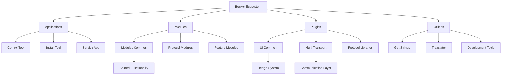

# Becker Tool


## Overview

A comprehensive Flutter monorepository containing multiple applications and modules for Becker motor control systems. The repository includes installation tools, control applications, and supporting libraries for various Becker motor protocols including Centronic PLUS, EVO, Timecontrol, and XCF systems.

**Supported Platforms:** Android, Windows, macOS, Linux

**Minimum Flutter Version:** 3.10.6

## Quick Start

```bash
# For Control Tool
cd control_tool
flutter pub get
flutter run -d (windows|macos|android) --verbose (--release)

# For Install Tool  
cd install_tool
flutter pub get
flutter run -d (windows|macos|android) --verbose (--release)

# For Service App
cd service_app
flutter pub get
flutter run -d (windows|macos|android) --verbose (--release)
```

## Module Documentation

Each module in the Becker ecosystem has its own detailed README file with comprehensive documentation. Click on the module name to view detailed documentation.

---

### **CONTROL TOOL** 📱
**[📖 Detailed Documentation](control_tool/README.md)**

| Field | Description |
| :--- | :--- |
| **Module Path** | `control_tool/` |
| **Type** | App |
| **Purpose/Goal** | A comprehensive control application (branded as "Be:You") for managing Becker motor systems including Centronic PLUS, EVO, Timecontrol, and CC Eleven devices. |

**Key Features/Functionality:**
* **Multi-Protocol Support**: Unified interface for Centronic PLUS, EVO, Timecontrol, and CC Eleven protocols
* **Real-time Monitoring**: Live device status, sensor readings, and performance metrics
* **Cross-Platform**: Native apps for Android, Windows, macOS, and Linux
* **Professional Features**: Device discovery, configuration management, and OTA firmware updates

**Dependencies/Integrations (External):**
* Flutter framework with Provider state management and GoRouter navigation
* Multi-transport layer for Bluetooth LE, USB, and socket communication
* 11-language internationalization support

**Enhanced Summary:**
The Control Tool (Be:You) is the flagship application for professional motor control, providing a sophisticated interface for managing complex Becker motor systems. It implements a modular architecture where each protocol is handled by specialized modules, enabling seamless integration of different motor types. The application features advanced capabilities including real-time device monitoring, comprehensive configuration management, over-the-air firmware updates, and multi-language support. Built with Flutter, it delivers native performance across all major platforms while maintaining a consistent user experience through the shared UI Common design system.

---

### **INSTALL TOOL** 🛠️
**[📖 Detailed Documentation](install_tool/README.md)**

| Field | Description |
| :--- | :--- |
| **Module Path** | `install_tool/` |
| **Type** | App |
| **Purpose/Goal** | A specialized installation and setup tool (branded as "Becker Tool") for professional installers and technicians working with Becker motor systems. |

**Key Features/Functionality:**
* **Installation Wizard**: Step-by-step guided setup process for complex motor installations
* **Multi-Protocol Support**: Centronic PLUS, EVO, Timecontrol, XCF, and CC Eleven protocols
* **Professional Tools**: Device configuration, sensor assignment, and network management
* **Firmware Management**: OTA updates, version tracking, and rollback capabilities

**Dependencies/Integrations (External):**
* Flutter framework with comprehensive modular architecture
* Multi-transport communication layer for various connection methods
* File system integration for firmware updates and documentation access

**Enhanced Summary:**
The Install Tool (Becker Tool) is the professional-grade installation and commissioning application designed specifically for installers, technicians, and service personnel. It provides a comprehensive suite of tools for setting up and configuring Becker motor systems, including guided installation wizards, advanced device configuration options, and sophisticated firmware management capabilities. The application supports multiple motor protocols and includes specialized features such as sensor assignment, network optimization, and installation documentation access. With its focus on professional workflows and comprehensive device support, it streamlines the installation process while ensuring proper configuration and system optimization.

---

### **SERVICE APP** 🔧
**[📖 Detailed Documentation](service_app/README.md)**

| Field | Description |
| :--- | :--- |
| **Module Path** | `service_app/` |
| **Type** | App |
| **Purpose/Goal** | A lightweight service application providing essential functionality and utilities for basic Becker motor system management and maintenance. |

**Key Features/Functionality:**
* **Basic Device Management**: Simple device connectivity and status monitoring
* **Essential Configuration**: Streamlined configuration interfaces for common tasks
* **Service Utilities**: Diagnostic tools and maintenance functions
* **Cross-Platform**: Support for Android, Windows, macOS, Linux, and Web platforms

**Dependencies/Integrations (External):**
* Flutter framework with minimal dependencies for lightweight operation
* UI Common library for consistent design and shared components
* Multi-language internationalization support

**Enhanced Summary:**
The Service App is designed as a lightweight, streamlined application for basic service operations and maintenance tasks. Unlike the full-featured Control Tool and Install Tool, it focuses on essential functionality that service technicians need for quick device checks, basic configuration adjustments, and routine maintenance. The application maintains a clean, simplified interface while providing access to core device management features. Built with minimal dependencies, it offers fast startup times and efficient operation, making it ideal for field service scenarios where quick access to basic device functions is more important than comprehensive configuration capabilities.

---

### **MODULES_COMMON** 🏗️
**[📖 Detailed Documentation](modules/modules_common/README.md)**

| Field | Description |
| :--- | :--- |
| **Module Path** | `modules/modules_common/` |
| **Type** | Package/Library |
| **Purpose/Goal** | The foundational shared library providing essential functionality, utilities, and base classes used across all Becker applications and modules. |

**Key Features/Functionality:**
* **Unified Exports**: Centralized import/export management for all common dependencies
* **Cross-Platform Support**: Consistent APIs across Android, Windows, macOS, Linux, and Web
* **State Management**: Provider-based state management utilities
* **Database Integration**: SQLite database operations and management

**Dependencies/Integrations (External):**
* Provider for reactive state management
* SQLite for local data storage and persistence
* HTTP package for network communication
* Flutter localization framework with 11+ language support

**Enhanced Summary:**
Modules Common is the cornerstone of the entire Becker ecosystem, serving as the single source of truth for shared functionality across all applications and modules. It provides a unified foundation layer that includes comprehensive internationalization support, consistent UI patterns, robust database operations, and reliable network communication capabilities. By centralizing common functionality, it ensures consistency across the entire product suite while significantly reducing code duplication and maintenance overhead. The library acts as a bridge between the Flutter framework and the specialized modules, providing standardized interfaces and utilities that enable rapid development of new features while maintaining architectural consistency.

---

### **MOD_CEN_PLUS** ⚙️
**[📖 Detailed Documentation](modules/mod_cen_plus/README.md)**

| Field | Description |
| :--- | :--- |
| **Module Path** | `modules/mod_cen_plus/` |
| **Type** | Package/Library |
| **Purpose/Goal** | A complete implementation module for the Centronic PLUS motor control protocol, providing comprehensive device management and configuration capabilities. |

**Key Features/Functionality:**
* **Protocol Implementation**: Complete Centronic PLUS protocol with bidirectional communication
* **Device Management**: Node discovery, configuration, and network management
* **Real-time Monitoring**: Live device status, sensor readings, and performance metrics
* **Firmware Management**: Over-the-air (OTA) updates with version tracking and rollback

**Dependencies/Integrations (External):**
* Centronic Plus protocol library for low-level communication
* Multi-transport communication layer for cross-platform connectivity
* Provider for reactive state management and real-time updates

**Enhanced Summary:**
The Centronic PLUS module is the most comprehensive protocol implementation in the Becker ecosystem, providing complete support for the Centronic PLUS motor control protocol. It offers sophisticated device management capabilities including automatic device discovery, advanced configuration management, and real-time monitoring of motor systems. The module implements a robust communication system that handles complex scenarios such as multi-device networks, sensor integration, and firmware management. With its focus on professional motor control applications, it provides the reliability and functionality needed for industrial and commercial motor control systems, making it the backbone of many Becker applications.

---

### **MOD_EVO** 🔄
**[📖 Detailed Documentation](modules/mod_evo/README.md)**

| Field | Description |
| :--- | :--- |
| **Module Path** | `modules/mod_evo/` |
| **Type** | Package/Library |
| **Purpose/Goal** | A specialized module for EVO motor control systems, providing advanced configuration and control interfaces for EVO-compatible devices. |

**Key Features/Functionality:**
* **EVO Protocol**: Complete implementation with Bluetooth Low Energy connectivity
* **Motor Profiles**: Advanced profile management and configuration system
* **Control Interfaces**: Speed, position, and special function control
* **Real-time Monitoring**: Live motor status and performance tracking

**Dependencies/Integrations (External):**
* EVO protocol library for low-level communication
* Bluetooth Low Energy for wireless device connectivity
* Provider for reactive state management

**Enhanced Summary:**
The EVO module represents the cutting-edge of Becker's motor control technology, implementing the complete EVO protocol with a focus on advanced motor management capabilities. It provides sophisticated interfaces for configuring motor profiles, adjusting speed settings, and managing special functions such as wind protection and sun tracking. The module leverages Bluetooth Low Energy for reliable wireless communication and integrates seamlessly with the shared navigation system, ensuring a consistent user experience across different motor types. With its emphasis on professional motor control and advanced automation features, it serves as the foundation for next-generation motor control applications.

---

### **MOD_TIMECONTROL**

| Field | Description |
| :--- | :--- |
| **Module Path** | `modules/mod_timecontrol/` |
| **Type** | Package/Library |
| **Purpose/Goal** | A comprehensive module for Timecontrol motor systems, providing time-based automation and scheduling capabilities. |

**Key Features/Functionality:**
* Time-based motor control and scheduling
* Astronomical calculations for sun protection systems
* Preset configuration and operation mode management
* Real-time clock synchronization and location-based settings

**Dependencies/Integrations (External):**
* Timecontrol protocol library
* Geolocator for location services
* Provider for state management

**Summary:**
The Timecontrol module provides advanced time-based automation for motor systems, particularly suited for sun protection and automated shading applications. It includes sophisticated astronomical calculations, preset management, and location-based scheduling. The module integrates with system location services to provide accurate sun position calculations and automated motor control based on time and environmental conditions.

---

### **MOD_CC_ELEVEN**

| Field | Description |
| :--- | :--- |
| **Module Path** | `modules/mod_cc_eleven/` |
| **Type** | Package/Library |
| **Purpose/Goal** | A specialized module for CC Eleven motor control systems, providing advanced device management and group control capabilities. |

**Key Features/Functionality:**
* CC Eleven protocol implementation with dual-service Bluetooth support
* Group management and synchronized motor control
* Advanced device configuration and settings management
* Integration with Centronic PLUS for hybrid systems

**Dependencies/Integrations (External):**
* CC Eleven protocol library
* Centronic Plus protocol integration
* Multi-transport communication layer

**Summary:**
The CC Eleven module provides advanced motor control capabilities with support for group operations and hybrid systems. It implements a sophisticated device management system that can handle both CC Eleven and Centronic PLUS protocols simultaneously, enabling complex motor control scenarios with synchronized group operations and advanced configuration options.

---

### **MOD_XCF**

| Field | Description |
| :--- | :--- |
| **Module Path** | `modules/mod_xcf/` |
| **Type** | Package/Library |
| **Purpose/Goal** | A module for XCF motor control systems, providing configuration wizards and setup tools for complex motor installations. |

**Key Features/Functionality:**
* XCF protocol implementation with setup wizard interface
* Project configuration and manufacturer settings
* Monitoring and alert system for motor status
* Advanced parameter configuration and maintenance tools

**Dependencies/Integrations (External):**
* XCF protocol library
* Provider for state management
* Multi-transport communication layer

**Summary:**
The XCF module provides comprehensive support for XCF motor control systems with a focus on professional installation and configuration. It includes a step-by-step setup wizard for complex installations, advanced monitoring capabilities, and detailed configuration options. The module is designed to handle sophisticated motor control scenarios with extensive parameter customization and real-time status monitoring.

---

### **MOD_UPDATE_FILE**

| Field | Description |
| :--- | :--- |
| **Module Path** | `modules/mod_update_file/` |
| **Type** | Package/Library |
| **Purpose/Goal** | A utility module providing file management and update capabilities for firmware and configuration files across Becker systems. |

**Key Features/Functionality:**
* File loading and parsing utilities for update packages
* Version management and compatibility checking
* Installation manual and documentation access
* Update synchronization and validation

**Dependencies/Integrations (External):**
* HTTP client for remote file access
* File system integration
* Version management utilities

**Summary:**
The Update File module provides essential file management capabilities for system updates and documentation access. It handles the loading and parsing of update packages, manages version compatibility, and provides access to installation documentation. This module is crucial for maintaining system integrity during firmware updates and ensuring users have access to current documentation and installation guides.

---

### **UI_COMMON** 🎨
**[📖 Detailed Documentation](plugins/ui_common/README.md)**

| Field | Description |
| :--- | :--- |
| **Module Path** | `plugins/ui_common/` |
| **Type** | Package/Library |
| **Purpose/Goal** | A comprehensive design system and component library providing standardized UI elements, themes, and navigation patterns for all Becker applications. |

**Key Features/Functionality:**
* **Design System**: Consistent theming, typography, and color palette
* **Component Library**: Comprehensive set of reusable UI components
* **Navigation System**: GoRouter-based navigation with deep linking support
* **Internationalization**: Multi-language support with 11+ languages

**Dependencies/Integrations (External):**
* Go Router for modern declarative navigation
* Provider for reactive state management
* Flutter localization framework for i18n support
* Package info for application metadata

**Enhanced Summary:**
UI Common is the design system foundation that ensures visual and functional consistency across the entire Becker product ecosystem. It provides a comprehensive library of reusable components, standardized navigation patterns, and robust internationalization support. The library serves as the single source of truth for design decisions, enabling rapid development of new features while maintaining a cohesive user experience. With its focus on accessibility, performance, and maintainability, it empowers developers to create professional-grade applications that meet the high standards expected in the motor control industry.

---

### **MULTI_TRANSPORT**

| Field | Description |
| :--- | :--- |
| **Module Path** | `plugins/multi_transport/` |
| **Type** | Package/Library |
| **Purpose/Goal** | A platform-independent transport layer providing unified communication interfaces for Bluetooth, serial, and socket connections. |

**Key Features/Functionality:**
* Unified interface for multiple communication protocols
* Bluetooth Low Energy, serial, and socket transport implementations
* Cross-platform device discovery and connection management
* Protocol abstraction layer for consistent API usage

**Dependencies/Integrations (External):**
* Platform-specific Bluetooth implementations
* Serial communication libraries
* Socket networking capabilities

**Summary:**
Multi-transport provides a crucial abstraction layer that enables consistent communication across different platforms and protocols. It unifies Bluetooth Low Energy, serial, and socket communications under a single interface, allowing modules to communicate with devices regardless of the underlying transport mechanism. This design enables the same code to work across different platforms while providing optimal performance for each communication method.

---

### **CENTRONIC_PLUS_PROTOCOL**

| Field | Description |
| :--- | :--- |
| **Module Path** | `plugins/centronic_plus/` |
| **Type** | Package/Library |
| **Purpose/Goal** | A pure Dart implementation of the Centronic PLUS communication protocol, providing low-level protocol handling and data structures. |

**Key Features/Functionality:**
* Complete Centronic PLUS protocol implementation
* Message encoding and decoding utilities
* Protocol state management and error handling
* Integration with multi-transport layer

**Dependencies/Integrations (External):**
* Multi-transport interface
* Hex encoding utilities
* Version management

**Summary:**
The Centronic Plus Protocol library provides the core implementation of the Centronic PLUS communication protocol in pure Dart. It handles all low-level protocol operations including message encoding, decoding, and state management. This library is essential for any application that needs to communicate with Centronic PLUS devices, providing a robust and reliable foundation for higher-level modules and applications.

---

### **HYDROGEN_FLUTTER**

| Field | Description |
| :--- | :--- |
| **Module Path** | `plugins/hydrogen_flutter/` |
| **Type** | Package/Library |
| **Purpose/Goal** | A cryptographic library wrapper providing secure communication and data protection capabilities for Becker applications. |

**Key Features/Functionality:**
* Cryptographic functions for secure communication
* Data encryption and decryption capabilities
* Security utilities for authentication and integrity
* Cross-platform cryptographic operations

**Dependencies/Integrations (External):**
* FFI (Foreign Function Interface) for native library integration
* Platform-specific cryptographic implementations

**Summary:**
Hydrogen Flutter provides essential cryptographic capabilities for secure communication in Becker applications. It wraps native cryptographic libraries using FFI to provide cross-platform security functions. This library is crucial for ensuring secure communication with devices and protecting sensitive configuration data during transmission and storage.

---

### **WIN_BLE**

| Field | Description |
| :--- | :--- |
| **Module Path** | `plugins/win_ble/` |
| **Type** | Package/Library |
| **Purpose/Goal** | A Windows-specific Bluetooth Low Energy plugin enabling BLE functionality for Flutter applications on Windows platforms. |

**Key Features/Functionality:**
* Windows Bluetooth Low Energy implementation
* Device discovery and connection management
* BLE service and characteristic access
* Windows-specific BLE server capabilities

**Dependencies/Integrations (External):**
* Windows Bluetooth APIs
* Native Windows BLE server executable

**Summary:**
Win BLE provides essential Bluetooth Low Energy functionality for Windows platforms, enabling Flutter applications to communicate with BLE devices on Windows. It includes both client and server capabilities, with a native Windows executable for BLE server functionality. This plugin is crucial for Windows users who need to connect to and control Becker motor systems via Bluetooth Low Energy.

---

### **GETSTRINGS**

| Field | Description |
| :--- | :--- |
| **Module Path** | `bin/getStrings/` |
| **Type** | Package/Library |
| **Purpose/Goal** | A utility tool for extracting and managing internationalization strings from the codebase, supporting translation workflow. |

**Key Features/Functionality:**
* Automatic extraction of translatable strings from Dart code
* Generation of .pot files for translation
* Integration with translation workflow tools
* Code analysis for i18n string identification

**Dependencies/Integrations (External):**
* Dart analyzer for code parsing
* Gettext parser for translation file handling

**Summary:**
GetStrings is a specialized development tool that automates the extraction of internationalization strings from the codebase. It analyzes Dart code to identify translatable strings and generates .pot files that can be used by translators. This tool is essential for maintaining the multi-language support across all Becker applications and ensures that new strings are properly identified and included in the translation workflow.

---

### **TRANSLATOR** 🤖
**[📖 Detailed Documentation](bin/translator/README.md)**

| Field | Description |
| :--- | :--- |
| **Module Path** | `bin/translator/` |
| **Type** | Package/Library |
| **Purpose/Goal** | An AI-powered translation tool that leverages modern translation services to automate the translation of application strings and documentation. |

**Key Features/Functionality:**
* **AI-Powered Translation**: OpenAI GPT models for high-quality translations
* **Automated Workflow**: Streamlined translation pipeline integration
* **Multi-Language Support**: Support for 11+ target languages
* **Quality Assurance**: Built-in validation and consistency checking

**Dependencies/Integrations (External):**
* OpenAI Dart client for AI translation services
* OpenAPI generator for flexible service integration

**Enhanced Summary:**
The Translator tool represents a modern approach to internationalization, leveraging cutting-edge AI technology to automate the translation of application strings and documentation. It integrates seamlessly with OpenAI's GPT models to provide context-aware, high-quality translations that maintain consistency across multiple language versions. The tool includes sophisticated quality assurance features, automated workflow integration, and comprehensive error handling, making it an essential component of the Becker internationalization strategy. By significantly reducing the time and effort required for translation tasks, it enables rapid deployment of multi-language applications while maintaining the high quality standards expected in professional motor control software.

---

## Development Tasks

### Extract i18n strings
Übersetzungsschlüssel werden extrahiert und in strings.pot gespeichert
<br>
### Mason: gen centronic_plus
Erzeugt Telegrammdecoder anhand der config Datei
<br>
### Doc: centronic_plus
Erzeugt Dokumentation
<br>
### Test: centronic_plus
Automatisierte Tests ausführen
<br>
<br>

## Repository Structure

This monorepository is organized into several key categories, each with its own purpose and documentation:

### 📱 **Applications** (Complete Flutter Apps)
- **[Control Tool](control_tool/)** - Professional motor control application (Be:You)
- **[Install Tool](install_tool/)** - Installation and commissioning tool (Becker Tool)
- **[Service App](service_app/)** - Lightweight service and maintenance application

### 🧩 **Modules** (Feature-Specific Packages)
- **[Modules Common](modules/modules_common/)** - Shared functionality and utilities
- **[Centronic PLUS](modules/mod_cen_plus/)** - Centronic PLUS protocol implementation
- **[EVO](modules/mod_evo/)** - EVO motor control module
- **[Timecontrol](modules/mod_timecontrol/)** - Time-based automation module
- **[CC Eleven](modules/mod_cc_eleven/)** - CC Eleven protocol module
- **[XCF](modules/mod_xcf/)** - XCF motor control module
- **[Update File](modules/mod_update_file/)** - File management and updates

### 🔌 **Plugins** (Reusable Libraries)
- **[UI Common](plugins/ui_common/)** - Design system and component library
- **[Multi Transport](plugins/multi_transport/)** - Cross-platform communication layer
- **[Protocol Libraries](plugins/)** - Protocol implementations (Centronic Plus, EVO, etc.)
- **[Win BLE](plugins/win_ble/)** - Windows Bluetooth Low Energy support
- **[Hydrogen Flutter](plugins/hydrogen_flutter/)** - Cryptographic library

### 🛠️ **Utilities** (Development Tools)
- **[Get Strings](bin/getStrings/)** - String extraction tool for i18n
- **[Translator](bin/translator/)** - AI-powered translation tool
- **[Tools](tools/)** - Development and maintenance utilities

### 📁 **Assets & Resources**
- **[Assets](assets/)** - Images, icons, fonts, and other resources
- **[Documentation](documentation/)** - Project documentation and guides

## Development Tools

### 🔍 **Internationalization Tools**
- **[Get Strings](bin/getStrings/README.md)** - Extract translatable strings from code
- **[Translator](bin/translator/README.md)** - AI-powered translation automation
- **[I18n Audit](tools/i18n_audit.py)** - Translation quality and completeness analysis

### 🏗️ **Development Workflow**
```bash
# Extract strings for translation
dart run getStrings lib/ -o strings.pot

# Translate using AI
dart run translator --input strings.pot --output translations/

# Audit translation quality
python tools/i18n_audit.py --output audit-report.html

# Build applications
flutter build windows --release
flutter build macos --release
flutter build apk --release
```

### 📊 **Quality Assurance**
- **Code Analysis**: Automated linting and formatting
- **Testing**: Unit, widget, and integration tests
- **Internationalization**: Multi-language support validation
- **Performance**: Cross-platform performance optimization

## Architecture Overview



Each module is designed to be independently maintainable while sharing common functionality through the modules_common and ui_common libraries, ensuring consistency and reducing code duplication across the entire ecosystem.
