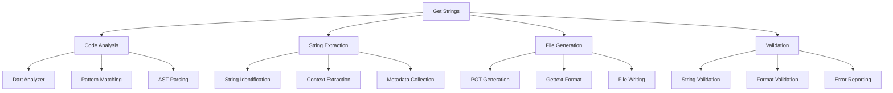

# Get Strings

[](https://github.com/becker-antriebe/getStrings)
[](https://dart.dev)

## Overview

Get Strings is a specialized utility tool for extracting and managing internationalization (i18n) strings from the Becker codebase. It automatically analyzes Dart code to identify translatable strings and generates `.pot` files that can be used by translators and translation management systems.

## Key Features

### 🔍 **String Extraction**
- **Automatic Detection**: Analyzes Dart code to identify translatable strings
- **Pattern Recognition**: Recognizes various i18n patterns and extensions
- **Context Preservation**: Maintains context information for better translations
- **Incremental Updates**: Supports incremental string extraction and updates

### 📝 **Translation File Generation**
- **POT File Generation**: Creates standard `.pot` files for translation tools
- **Gettext Format**: Uses industry-standard gettext format
- **Metadata Support**: Includes source file and line number information
- **Validation**: Validates extracted strings for completeness

### 🔧 **Development Workflow Integration**
- **CI/CD Integration**: Designed for automated build pipelines
- **Batch Processing**: Processes multiple files and directories
- **Error Reporting**: Comprehensive error reporting and validation
- **Configurable**: Flexible configuration for different projects

## Architecture

### Core Components



### Processing Pipeline
1. **Code Analysis**: Parse Dart source files using analyzer
2. **String Detection**: Identify translatable strings using patterns
3. **Context Extraction**: Extract context and metadata
4. **File Generation**: Generate standardized POT files
5. **Validation**: Validate output and report errors

## Dependencies

### Core Dependencies
```yaml
dependencies:
  # Code Analysis
  analyzer: ^6.0.0
  
  # String Processing
  equatable: ^2.0.5
  gettext_parser: ^0.2.0
  
  # Command Line Interface
  args: ^2.4.2
```

### Development Dependencies
```yaml
dev_dependencies:
  lints: ^2.0.0
  test: ^1.16.0
```

## Usage

### Command Line Interface
```bash
# Basic usage
dart run getStrings [options] <input_directory>

# Extract strings from specific directory
dart run getStrings lib/

# Output to specific file
dart run getStrings lib/ -o strings.pot

# Include additional patterns
dart run getStrings lib/ --patterns "*.i18n" --patterns "*.tr"

# Verbose output
dart run getStrings lib/ --verbose
```

### Command Line Options
```bash
Options:
  -o, --output          Output file path (default: strings.pot)
  -p, --patterns        String patterns to match (default: *.i18n)
  -v, --verbose         Enable verbose output
  -h, --help            Show help information
  --exclude             Exclude specific files or directories
  --include             Include only specific files or directories
  --project-name        Project name for POT file header
  --version             Show version information
```

### Programmatic Usage
```dart
import 'package:getstrings/getstrings.dart';

void main() async {
  final extractor = StringExtractor();
  
  // Configure extraction settings
  extractor.patterns = ['*.i18n', '*.tr'];
  extractor.excludePatterns = ['**/test/**'];
  
  // Extract strings
  final result = await extractor.extractFromDirectory('lib/');
  
  // Generate POT file
  await extractor.generatePotFile(result, 'strings.pot');
}
```

## String Detection

### Supported Patterns

#### i18n Extension
```dart
// Detects: "Hello World"
Text('Hello World'.i18n)

// Detects: "Welcome {name}"
Text('Welcome {name}'.i18n.fill({'name': userName}))
```

#### Translation Function
```dart
// Detects: "Save"
Text(translate('Save'))

// Detects: "Delete {item}"
Text(translate('Delete {item}', {'item': itemName}))
```

#### Localization Keys
```dart
// Detects: "app.title"
Text(Localizations.of(context).appTitle)

// Detects: "error.network"
Text(Localizations.of(context).networkError)
```

### Context Information
- **Source File**: File path where string was found
- **Line Number**: Line number in source file
- **Function Context**: Function or method containing the string
- **Class Context**: Class containing the string
- **Comments**: Nearby comments that might provide context

## Output Format

### POT File Structure
```pot
# SOME DESCRIPTIVE TITLE.
# Copyright (C) YEAR THE PACKAGE'S COPYRIGHT HOLDER
# This file is distributed under the same license as the PACKAGE package.
# FIRST AUTHOR <EMAIL@ADDRESS>, YEAR.
#
msgid ""
msgstr ""
"Project-Id-Version: PACKAGE VERSION\n"
"Report-Msgid-Bugs-To: \n"
"POT-Creation-Date: 2024-01-01 12:00+0000\n"
"PO-Revision-Date: YEAR-MO-DA HO:MI+ZONE\n"
"Last-Translator: FULL NAME <EMAIL@ADDRESS>\n"
"Language-Team: LANGUAGE <LL@li.org>\n"
"Language: \n"
"MIME-Version: 1.0\n"
"Content-Type: text/plain; charset=CHARSET\n"
"Content-Transfer-Encoding: 8bit\n"

#: lib/main.dart:15
msgid "Hello World"
msgstr ""

#: lib/settings.dart:23
msgid "Welcome {name}"
msgstr ""
```

### Metadata Fields
- **Project-Id-Version**: Project name and version
- **Report-Msgid-Bugs-To**: Bug reporting contact
- **POT-Creation-Date**: Creation timestamp
- **PO-Revision-Date**: Last revision timestamp
- **Last-Translator**: Last translator information
- **Language-Team**: Translation team information
- **MIME-Version**: MIME version
- **Content-Type**: Content type and charset
- **Content-Transfer-Encoding**: Transfer encoding

## Configuration

### Configuration File
Create a `getstrings.yaml` file in your project root:
```yaml
# String extraction configuration
patterns:
  - "*.i18n"
  - "*.tr"
  - "translate(*)"

exclude:
  - "**/test/**"
  - "**/generated/**"

include:
  - "lib/**/*.dart"

output:
  file: "strings.pot"
  format: "gettext"

project:
  name: "Becker Tool"
  version: "1.0.0"
  copyright: "Becker-Antriebe GmbH"
  email: "support@becker-antriebe.com"

header:
  charset: "UTF-8"
  encoding: "8bit"
  language: ""
```

### Environment Variables
```bash
# Set project information
export GETSTRINGS_PROJECT_NAME="Becker Tool"
export GETSTRINGS_PROJECT_VERSION="1.0.0"
export GETSTRINGS_COPYRIGHT="Becker-Antriebe GmbH"
export GETSTRINGS_EMAIL="support@becker-antriebe.com"

# Set output options
export GETSTRINGS_OUTPUT_FILE="strings.pot"
export GETSTRINGS_VERBOSE="true"
```

## Integration

### CI/CD Integration
```yaml
# GitHub Actions example
name: Extract Strings
on: [push, pull_request]

jobs:
  extract-strings:
    runs-on: ubuntu-latest
    steps:
      - uses: actions/checkout@v3
      - uses: dart-lang/setup-dart@v1
      - run: dart pub get
      - run: dart run getStrings lib/ -o strings.pot
      - name: Check for changes
        run: |
          if [[ $(git status --porcelain) ]]; then
            echo "String extraction found changes"
            git diff strings.pot
            exit 1
          fi
```

### Makefile Integration
```makefile
# Extract strings
.PHONY: extract-strings
extract-strings:
	dart run getStrings lib/ -o strings.pot

# Update translations
.PHONY: update-translations
update-translations: extract-strings
	msgmerge -U de.po strings.pot
	msgmerge -U en.po strings.pot
	msgmerge -U fr.po strings.pot

# Validate translations
.PHONY: validate-translations
validate-translations:
	msgfmt --check de.po
	msgfmt --check en.po
	msgfmt --check fr.po
```

## Troubleshooting

### Common Issues

#### String Not Detected
- Check if string matches supported patterns
- Verify file is included in search paths
- Check for syntax errors in source code
- Ensure string is not in excluded directories

#### Invalid POT File
- Verify output file permissions
- Check for encoding issues
- Validate gettext format compliance
- Ensure proper header information

#### Performance Issues
- Exclude unnecessary directories
- Use specific file patterns
- Process files in smaller batches
- Check for large source files

### Debug Mode
```bash
# Enable verbose output
dart run getStrings lib/ --verbose

# Check specific files
dart run getStrings lib/main.dart --verbose

# Validate configuration
dart run getStrings --validate-config
```

## Development

### Project Structure
```
getStrings/
├── lib/
│   ├── main.dart              # Command line interface
│   ├── extractor.dart         # String extraction logic
│   ├── analyzer.dart          # Code analysis utilities
│   ├── generator.dart         # POT file generation
│   └── validator.dart         # Validation utilities
├── test/
│   ├── extractor_test.dart    # Extraction tests
│   ├── generator_test.dart    # Generation tests
│   └── validator_test.dart    # Validation tests
├── pubspec.yaml              # Dependencies
└── README.md                 # This file
```

### Building
```bash
# Install dependencies
dart pub get

# Run tests
dart test

# Analyze code
dart analyze

# Format code
dart format .
```

### Testing
```bash
# Run all tests
dart test

# Run specific test file
dart test test/extractor_test.dart

# Run tests with coverage
dart test --coverage
```

## Contributing

### Development Guidelines
1. Follow Dart style guidelines
2. Add comprehensive tests
3. Update documentation
4. Ensure cross-platform compatibility
5. Validate with real projects

### Code Style
- Use `dart format` for code formatting
- Follow existing naming conventions
- Add comprehensive comments
- Use type annotations where helpful

### Testing Requirements
- Unit tests for all extraction logic
- Integration tests with sample code
- Performance tests with large codebases
- Validation tests for output format

## License

This project is proprietary software developed by Becker-Antriebe GmbH. All rights reserved.

## Support

For technical support and questions:
- **Documentation**: [Internal Wiki](https://wiki.becker-antriebe.com)
- **Issues**: [Internal Issue Tracker](https://gitlab.becker-antriebe.com)
- **Email**: support@becker-antriebe.com

---

**Note**: This tool is essential for maintaining the multi-language support across all Becker applications. Always run string extraction before releasing new versions to ensure translators have access to all new translatable strings.
