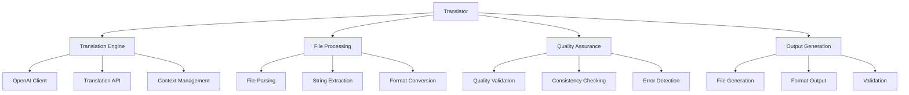

# Translator

[](https://github.com/becker-antriebe/translator)
[](https://dart.dev)
[](https://openai.com)

## Overview

Translator is an AI-powered translation tool that leverages modern translation services to automate the translation of application strings and documentation. It integrates with OpenAI services to provide high-quality translations and includes OpenAPI integration for flexible service configuration.

## Key Features

### 🤖 **AI-Powered Translation**
- **OpenAI Integration**: Leverages GPT models for high-quality translations
- **Context-Aware**: Maintains context for accurate translations
- **Batch Processing**: Processes multiple strings efficiently
- **Quality Assurance**: Built-in quality validation and checking

### 🔧 **Translation Workflow**
- **Automated Pipeline**: Streamlined translation workflow
- **Format Support**: Supports various translation file formats
- **Incremental Updates**: Updates existing translations efficiently
- **Validation**: Validates translation quality and completeness

### 🌐 **Multi-Language Support**
- **Language Detection**: Automatic source language detection
- **Target Languages**: Support for multiple target languages
- **Language Pairs**: Optimized for common language combinations
- **Regional Variants**: Support for regional language variants

### 📊 **Translation Management**
- **Progress Tracking**: Real-time translation progress monitoring
- **Error Handling**: Comprehensive error handling and reporting
- **Retry Logic**: Automatic retry for failed translations
- **Logging**: Detailed logging for debugging and auditing

## Architecture

### Core Components



### Translation Pipeline
1. **File Processing**: Parse input translation files
2. **String Extraction**: Extract translatable strings
3. **AI Translation**: Process strings through OpenAI API
4. **Quality Assurance**: Validate translation quality
5. **Output Generation**: Generate translated files

## Dependencies

### Core Dependencies
```yaml
dependencies:
  # AI Translation
  openai_dart: ^0.4.5
  
  # API Generation
  openapi_generator: ^6.1.0
  openapi_generator_annotations: ^6.1.0
```

### Development Dependencies
```yaml
dev_dependencies:
  lints: ^2.0.0
  test: ^1.16.0
  build_runner: ^2.4.13
```

## Usage

### Command Line Interface
```bash
# Basic translation
dart run translator --input strings.pot --output translations/

# Specify target languages
dart run translator --input strings.pot --languages de,fr,es --output translations/

# Use specific OpenAI model
dart run translator --input strings.pot --model gpt-4 --output translations/

# Batch processing
dart run translator --input-dir ./pot_files/ --output-dir ./translations/

# Verbose output
dart run translator --input strings.pot --verbose --output translations/
```

### Command Line Options
```bash
Options:
  -i, --input              Input file or directory
  -o, --output             Output directory
  -l, --languages          Target languages (comma-separated)
  -m, --model              OpenAI model to use (default: gpt-3.5-turbo)
  -k, --api-key            OpenAI API key
  -v, --verbose            Enable verbose output
  -h, --help               Show help information
  --config                 Configuration file path
  --batch-size             Batch size for processing
  --timeout                Request timeout in seconds
  --retry-attempts         Number of retry attempts
```

### Programmatic Usage
```dart
import 'package:translator/translator.dart';

void main() async {
  final translator = Translator();
  
  // Configure OpenAI API
  translator.apiKey = 'your-api-key';
  translator.model = 'gpt-4';
  
  // Configure translation settings
  translator.targetLanguages = ['de', 'fr', 'es'];
  translator.batchSize = 10;
  
  // Process translation file
  await translator.translateFile(
    inputFile: 'strings.pot',
    outputDir: 'translations/',
  );
}
```

## Configuration

### Configuration File
Create a `translator.yaml` file in your project root:
```yaml
# Translation configuration
openai:
  api_key: "your-openai-api-key"
  model: "gpt-4"
  max_tokens: 2000
  temperature: 0.3

languages:
  source: "en"
  targets:
    - "de"
    - "fr"
    - "es"
    - "it"
    - "nl"

processing:
  batch_size: 10
  timeout: 30
  retry_attempts: 3
  parallel_requests: 5

output:
  format: "po"
  encoding: "utf-8"
  include_metadata: true
  validate_output: true

quality:
  check_consistency: true
  validate_length: true
  check_formatting: true
  min_confidence: 0.8
```

### Environment Variables
```bash
# OpenAI Configuration
export OPENAI_API_KEY="your-api-key"
export OPENAI_MODEL="gpt-4"

# Translation Settings
export TRANSLATOR_TARGET_LANGUAGES="de,fr,es"
export TRANSLATOR_BATCH_SIZE="10"
export TRANSLATOR_TIMEOUT="30"
```

## Supported Formats

### Input Formats
- **POT Files**: Gettext template files
- **PO Files**: Gettext translation files
- **JSON**: JSON translation files
- **XML**: XML translation files
- **YAML**: YAML translation files

### Output Formats
- **PO Files**: Gettext translation files
- **JSON**: JSON translation files
- **XML**: XML translation files
- **YAML**: YAML translation files
- **Dart**: Dart translation files

## Language Support

### Supported Languages
- **German (de)**: Deutsch
- **French (fr)**: Français
- **Spanish (es)**: Español
- **Italian (it)**: Italiano
- **Dutch (nl)**: Nederlands
- **Portuguese (pt)**: Português
- **Russian (ru)**: Русский
- **Chinese (zh)**: 中文
- **Japanese (ja)**: 日本語
- **Korean (ko)**: 한국어

### Language Variants
- **Regional Variants**: Support for regional language variants
- **Formal/Informal**: Formal and informal tone options
- **Technical Terms**: Specialized technical terminology
- **Context Awareness**: Context-sensitive translations

## Quality Assurance

### Translation Quality
- **Consistency Checking**: Ensures consistent terminology
- **Length Validation**: Validates translation length appropriateness
- **Formatting Validation**: Checks for proper formatting
- **Confidence Scoring**: Provides confidence scores for translations

### Error Detection
- **Missing Translations**: Detects untranslated strings
- **Format Errors**: Identifies formatting issues
- **Inconsistencies**: Finds translation inconsistencies
- **Quality Issues**: Flags low-quality translations

### Validation Rules
```dart
class ValidationRules {
  static const double minConfidence = 0.8;
  static const int maxLengthRatio = 2;
  static const List<String> requiredFields = ['msgid', 'msgstr'];
  static const Map<String, String> forbiddenTerms = {
    'placeholder': 'actual_text',
  };
}
```

## Integration

### CI/CD Integration
```yaml
# GitHub Actions example
name: Translate Strings
on: [push, pull_request]

jobs:
  translate:
    runs-on: ubuntu-latest
    steps:
      - uses: actions/checkout@v3
      - uses: dart-lang/setup-dart@v1
      - run: dart pub get
      - name: Translate strings
        run: |
          dart run translator --input strings.pot --output translations/
        env:
          OPENAI_API_KEY: ${{ secrets.OPENAI_API_KEY }}
      - name: Validate translations
        run: dart run translator --validate translations/
```

### Makefile Integration
```makefile
# Translate strings
.PHONY: translate
translate:
	dart run translator --input strings.pot --output translations/

# Update translations
.PHONY: update-translations
update-translations: translate
	@echo "Translations updated"

# Validate translations
.PHONY: validate-translations
validate-translations:
	dart run translator --validate translations/
```

## Troubleshooting

### Common Issues

#### API Key Problems
- Verify OpenAI API key is valid and active
- Check API key permissions and usage limits
- Ensure proper environment variable configuration
- Test API key with OpenAI API directly

#### Translation Quality Issues
- Adjust temperature and model parameters
- Provide more context for complex strings
- Use domain-specific prompts for technical terms
- Implement post-processing validation

#### Performance Issues
- Optimize batch size for your API limits
- Implement proper rate limiting
- Use parallel processing for large files
- Cache translations to avoid re-processing

### Debug Mode
```bash
# Enable verbose output
dart run translator --input strings.pot --verbose

# Test API connection
dart run translator --test-api

# Validate configuration
dart run translator --validate-config
```

## Development

### Project Structure
```
translator/
├── lib/
│   ├── main.dart              # Command line interface
│   ├── translator.dart        # Main translation logic
│   ├── openai_client.dart     # OpenAI API client
│   ├── file_processor.dart    # File processing utilities
│   ├── validator.dart         # Translation validation
│   └── config.dart           # Configuration management
├── test/
│   ├── translator_test.dart   # Translation tests
│   ├── client_test.dart       # API client tests
│   └── validator_test.dart    # Validation tests
├── pubspec.yaml              # Dependencies
└── README.md                 # This file
```

### Building
```bash
# Install dependencies
dart pub get

# Run tests
dart test

# Analyze code
dart analyze

# Format code
dart format .
```

### Testing
```bash
# Run all tests
dart test

# Run specific test file
dart test test/translator_test.dart

# Run tests with coverage
dart test --coverage
```

## Contributing

### Development Guidelines
1. Follow Dart style guidelines
2. Add comprehensive tests
3. Update documentation
4. Ensure API compatibility
5. Validate translation quality

### Code Style
- Use `dart format` for code formatting
- Follow existing naming conventions
- Add comprehensive comments
- Use type annotations where helpful

### Testing Requirements
- Unit tests for all translation logic
- Integration tests with OpenAI API
- Validation tests for output quality
- Performance tests for large files

## License

This project is proprietary software developed by Becker-Antriebe GmbH. All rights reserved.

## Support

For technical support and questions:
- **Documentation**: [Internal Wiki](https://wiki.becker-antriebe.com)
- **Issues**: [Internal Issue Tracker](https://gitlab.becker-antriebe.com)
- **Email**: support@becker-antriebe.com

---

**Note**: This tool requires a valid OpenAI API key and internet connectivity. Translation costs are based on OpenAI's pricing model. Always review and validate AI-generated translations before using them in production applications.
