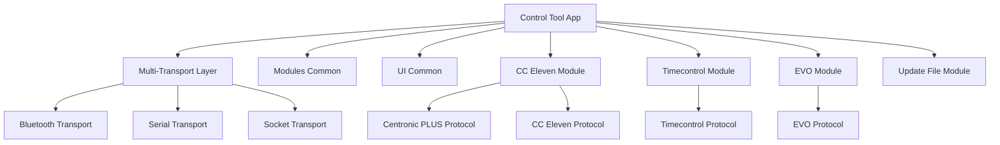

# Control Tool (Be:You)

[](https://github.com/becker-antriebe/control_tool)
[](https://flutter.dev)
[](https://flutter.dev/docs/development/platform-integration)

## Overview

The Control Tool, branded as "Be:You", is a comprehensive Flutter application designed for professional motor control and management of Becker motor systems. It provides a unified interface for controlling multiple Becker motor protocols including Centronic PLUS, EVO, Timecontrol, and CC Eleven devices through various communication channels.

## Key Features

### 🎛️ **Multi-Protocol Support**
- **Centronic PLUS**: Full protocol implementation with node management and configuration
- **EVO**: Advanced motor control with profile management and speed control
- **Timecontrol**: Time-based automation with astronomical calculations
- **CC Eleven**: Group management and synchronized motor control

### 📱 **Cross-Platform Compatibility**
- **Android**: Native Android app with Bluetooth Low Energy support
- **Windows**: Desktop application with USB and BLE connectivity
- **macOS**: Native macOS app with full system integration
- **Linux**: Desktop Linux support for development and deployment

### 🔧 **Professional Features**
- Real-time device monitoring and status reporting
- Device discovery and pairing capabilities
- Configuration management and parameter adjustment
- Over-the-air (OTA) firmware update support
- Multi-language support (11 languages)

### 🌐 **Communication Channels**
- Bluetooth Low Energy (BLE) for wireless connectivity
- USB serial communication for direct connections
- WebSocket support for remote control
- Multi-transport layer abstraction

## Architecture

### Core Components



### State Management
- **Provider Pattern**: Reactive state management using Provider
- **Stream-based Updates**: Real-time device status updates
- **Modular Architecture**: Each protocol implemented as independent module

### Navigation
- **GoRouter**: Modern declarative routing
- **Stateful Shell Routes**: Complex navigation with multiple branches
- **Deep Linking**: Support for direct navigation to device configurations

## Supported Languages

The application supports 11 languages:
- 🇩🇪 German (Deutsch)
- 🇨🇿 Czech (Čeština)
- 🇬🇧 English
- 🇪🇸 Spanish (Español)
- 🇫🇷 French (Français)
- 🇭🇺 Hungarian (Magyar)
- 🇮🇹 Italian (Italiano)
- 🇳🇱 Dutch (Nederlands)
- 🇸🇪 Swedish (Svenska)
- 🇹🇷 Turkish (Türkçe)
- 🇵🇱 Polish (Polski)

## Installation & Setup

### Prerequisites
- Flutter SDK 3.10.6 or higher
- Dart SDK 3.3.0 or higher
- Platform-specific development tools

### Quick Start

```bash
# Clone the repository
git clone <repository-url>
cd control_tool

# Install dependencies
flutter pub get

# Run on specific platform
flutter run -d windows --verbose
flutter run -d macos --verbose
flutter run -d android --verbose
```

### Platform-Specific Setup

#### Windows
- Visual Studio with C++ development tools
- Windows SDK 10.0 or higher
- USB driver support for device communication

#### macOS
- Xcode 14.0 or higher
- macOS 10.15 or higher
- Bluetooth Low Energy support

#### Android
- Android Studio
- Android SDK API level 21 or higher
- Bluetooth permissions in manifest

## Configuration

### MSIX Package Configuration
The Windows version includes MSIX packaging configuration:
- **Display Name**: Control Tool
- **Publisher**: Becker-Antriebe GmbH
- **Identity**: BeckerAntriebeGmbH.CentronicPLUSTool
- **Capabilities**: USB access for device communication

### Asset Management
- **Images**: Device photos, sensor icons, product images
- **Fonts**: SourceCodePro (monospace), BeckerIcons (custom icon font)
- **Protocol Assets**: EVO, Timecontrol, and XCF specific resources

## Development

### Project Structure
```
control_tool/
├── lib/
│   ├── main.dart              # Application entry point
│   ├── home.dart              # Main navigation screen
│   ├── extra_translations.dart # Additional translation strings
│   └── licenses/              # License management
├── assets/                    # Application assets
├── android/                   # Android platform files
├── ios/                       # iOS platform files
├── windows/                   # Windows platform files
├── macos/                     # macOS platform files
├── linux/                     # Linux platform files
└── pubspec.yaml              # Dependencies and configuration
```

### Key Dependencies
- **modules_common**: Shared functionality across modules
- **mod_cc_eleven**: CC Eleven protocol implementation
- **mod_timecontrol**: Timecontrol protocol support
- **mod_evo**: EVO protocol implementation
- **mod_update_file**: File management and updates

### Building for Production

```bash
# Build for Windows
flutter build windows --release

# Build for macOS
flutter build macos --release

# Build for Android
flutter build apk --release
```

## Usage

### Device Discovery
1. Launch the application
2. Navigate to device discovery screen
3. Select communication method (Bluetooth/USB)
4. Scan for available devices
5. Connect to desired device

### Device Configuration
1. Select connected device from list
2. Navigate to configuration screen
3. Adjust parameters as needed
4. Save configuration to device
5. Test device operation

### Firmware Updates
1. Navigate to update section
2. Check for available updates
3. Download update package
4. Install update to device
5. Verify successful update

## Troubleshooting

### Common Issues

#### Bluetooth Connection Problems
- Ensure Bluetooth is enabled on device
- Check device pairing status
- Restart Bluetooth service
- Clear Bluetooth cache (Android)

#### USB Connection Issues
- Verify USB cable connection
- Check device drivers
- Try different USB port
- Restart application

#### Device Not Found
- Ensure device is in pairing mode
- Check device proximity
- Verify protocol compatibility
- Restart device discovery

### Debug Mode
Enable debug mode for detailed logging:
```bash
flutter run --debug --verbose
```

## Contributing

### Development Guidelines
1. Follow Flutter/Dart style guidelines
2. Use meaningful commit messages
3. Add tests for new features
4. Update documentation as needed

### Code Style
- Use `dart format` for code formatting
- Follow existing naming conventions
- Add comprehensive comments
- Use type annotations where helpful

## License

This project is proprietary software developed by Becker-Antriebe GmbH. All rights reserved.

## Support

For technical support and questions:
- **Documentation**: [Internal Wiki](https://wiki.becker-antriebe.com)
- **Issues**: [Internal Issue Tracker](https://gitlab.becker-antriebe.com)
- **Email**: support@becker-antriebe.com

## Changelog

### Version 0.0.5+5
- Enhanced device discovery reliability
- Improved Bluetooth connection stability
- Added support for additional device types
- Bug fixes and performance improvements

---

**Note**: This application is designed for professional use by trained technicians. Always follow manufacturer guidelines and safety procedures when working with motor control systems.