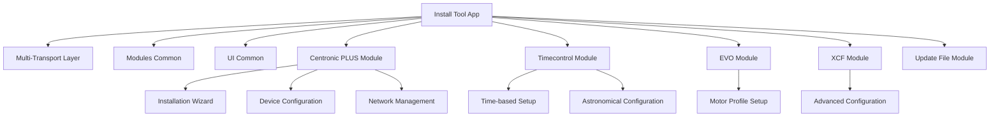

# Install Tool (Becker Tool)

[](https://github.com/becker-antriebe/install_tool)
[](https://flutter.dev)
[](https://flutter.dev/docs/development/platform-integration)

## Overview

The Install Tool, branded as "Becker Tool", is a specialized Flutter application designed for professional installation and commissioning of Becker motor control systems. It provides comprehensive tools for device setup, configuration, and maintenance, specifically tailored for installers, technicians, and service personnel.

## Key Features

### 🛠️ **Professional Installation Tools**
- **Device Installation Wizard**: Step-by-step guided setup process
- **Configuration Management**: Advanced parameter adjustment and calibration
- **Firmware Updates**: Over-the-air (OTA) and USB-based firmware management
- **Installation Documentation**: Integrated manuals and guides

### 📋 **Multi-Protocol Support**
- **Centronic PLUS**: Complete installation and configuration workflow
- **EVO**: Motor setup and profile configuration
- **Timecontrol**: Time-based automation setup
- **XCF**: Advanced motor control system installation
- **CC Eleven**: Group installation and management

### 🔧 **Installation-Specific Features**
- **Sensor Assignment**: Automatic and manual sensor configuration
- **Sun Protection Settings**: Weather-based automation setup
- **Network Management**: Device network configuration and optimization
- **Installation Completion**: End-to-end installation workflow

### 📱 **Cross-Platform Compatibility**
- **Windows**: Primary platform with full USB support
- **macOS**: Native macOS application
- **Android**: Mobile support for field installation
- **Linux**: Development and deployment support

## Architecture

### Core Components



### Installation Workflow
1. **Device Discovery**: Automatic detection of connected devices
2. **Initial Configuration**: Basic setup and parameter adjustment
3. **Network Setup**: Device network configuration and optimization
4. **Sensor Assignment**: Automatic and manual sensor configuration
5. **Testing & Validation**: Device testing and operation verification
6. **Documentation**: Installation completion and documentation

## Supported Languages

The application supports 11 languages:
- 🇩🇪 German (Deutsch)
- 🇨🇿 Czech (Čeština)
- 🇬🇧 English
- 🇪🇸 Spanish (Español)
- 🇫🇷 French (Français)
- 🇭🇺 Hungarian (Magyar)
- 🇮🇹 Italian (Italiano)
- 🇳🇱 Dutch (Nederlands)
- 🇸🇪 Swedish (Svenska)
- 🇹🇷 Turkish (Türkçe)
- 🇵🇱 Polish (Polski)

## Installation & Setup

### Prerequisites
- Flutter SDK 3.10.6 or higher
- Dart SDK 3.3.0 or higher
- Platform-specific development tools

### Quick Start

```bash
# Clone the repository
git clone <repository-url>
cd install_tool

# Install dependencies
flutter pub get

# Run on specific platform
flutter run -d windows --verbose
flutter run -d macos --verbose
flutter run -d android --verbose
```

### Platform-Specific Setup

#### Windows
- Visual Studio with C++ development tools
- Windows SDK 10.0 or higher
- USB driver support for device communication

#### macOS
- Xcode 14.0 or higher
- macOS 10.15 or higher
- Bluetooth Low Energy support

#### Android
- Android Studio
- Android SDK API level 21 or higher
- Bluetooth permissions in manifest

## Configuration

### MSIX Package Configuration
The Windows version includes MSIX packaging configuration:
- **Display Name**: Becker Tool
- **Publisher**: Becker-Antriebe GmbH
- **Identity**: BeckerAntriebeGmbH.CentronicPLUSTool
- **Capabilities**: USB access for device communication
- **Store Distribution**: Microsoft Store compatible

### Asset Management
- **Images**: Device photos, sensor icons, product images
- **Fonts**: SourceCodePro (monospace), BeckerIcons (custom icon font)
- **Protocol Assets**: EVO, Timecontrol, and XCF specific resources
- **Documentation**: Installation manuals and guides

## Development

### Project Structure
```
install_tool/
├── lib/
│   ├── main.dart              # Application entry point
│   ├── home.dart              # Main navigation screen
│   ├── extra_translations.dart # Additional translation strings
│   ├── oss_licenses.dart      # Open source license management
│   └── licenses_view.dart     # License display
├── assets/                    # Application assets
├── android/                   # Android platform files
├── ios/                       # iOS platform files
├── windows/                   # Windows platform files
├── macos/                     # macOS platform files
├── linux/                     # Linux platform files
├── CHANGELOG.md              # Version history and changes
└── pubspec.yaml              # Dependencies and configuration
```

### Key Dependencies
- **modules_common**: Shared functionality across modules
- **mod_cen_plus**: Centronic PLUS protocol implementation
- **mod_timecontrol**: Timecontrol protocol support
- **mod_evo**: EVO protocol implementation
- **mod_xcf**: XCF protocol support
- **mod_update_file**: File management and updates

### Building for Production

```bash
# Build for Windows
flutter build windows --release

# Build for macOS
flutter build macos --release

# Build for Android
flutter build apk --release
```

## Usage

### Installation Workflow

#### 1. Device Discovery
1. Launch the application
2. Connect USB stick or enable Bluetooth
3. Navigate to device discovery
4. Scan for available devices
5. Select device for installation

#### 2. Initial Configuration
1. Run installation wizard
2. Configure basic device parameters
3. Set up device network
4. Assign device names and locations

#### 3. Advanced Configuration
1. Configure sensor assignments
2. Set up sun protection settings
3. Configure time-based automation
4. Set up group operations (if applicable)

#### 4. Testing & Validation
1. Test device operation
2. Verify sensor readings
3. Test automation functions
4. Validate network communication

#### 5. Installation Completion
1. Generate installation report
2. Save configuration backup
3. Provide customer documentation
4. Complete installation checklist

### Device Management

#### Sensor Assignment
- **Automatic Assignment**: AI-powered sensor detection and assignment
- **Manual Assignment**: Custom sensor configuration
- **Sensor Validation**: Real-time sensor reading verification
- **Assignment Backup**: Configuration backup and restore

#### Network Management
- **Network Discovery**: Automatic device network detection
- **Network Optimization**: Performance tuning and optimization
- **Security Configuration**: Network security and access control
- **Network Monitoring**: Real-time network status monitoring

## Troubleshooting

### Common Issues

#### USB Connection Problems
- Verify USB cable connection
- Check USB stick functionality
- Restart application
- Try different USB port

#### Device Discovery Issues
- Ensure device is in pairing mode
- Check device proximity
- Verify protocol compatibility
- Restart device discovery

#### Configuration Problems
- Validate parameter ranges
- Check device compatibility
- Verify network settings
- Restart configuration process

### Debug Mode
Enable debug mode for detailed logging:
```bash
flutter run --debug --verbose
```

## Changelog

### Version 1.3.2+75
- Enhanced installation wizard reliability
- Improved sensor assignment accuracy
- Added support for additional device types
- Bug fixes and performance improvements

### Version 1.0.21/1.0.22
- Unified interfaces for Android Bluetooth, Android USB, iOS Bluetooth, Mac and Windows USB
- Application architecture improvements

### Version 1.0.20
- Added English, Swedish, Spanish, Czech translations
- Fixed network-wide radio reset functionality
- Temporarily enabled OTA User Update for SC861 testing
- Standardized Yes/No dialog positioning

### Version 1.0.19 (HOTFIX)
- Forced USB timeout back to 0

### Version 1.0.18
- Enhanced settings - Clear all sensor assignments
- Extended translations
- Installation completion - Query whether stick remains with customer or installer
- Immediate sensor value display for telegram-discovered sensors
- Updated graphics
- Adjusted BLE MTU to 64 bytes

## Contributing

### Development Guidelines
1. Follow Flutter/Dart style guidelines
2. Use meaningful commit messages
3. Add tests for new features
4. Update documentation as needed
5. Test installation workflows thoroughly

### Code Style
- Use `dart format` for code formatting
- Follow existing naming conventions
- Add comprehensive comments
- Use type annotations where helpful

## License

This project is proprietary software developed by Becker-Antriebe GmbH. All rights reserved.

## Support

For technical support and questions:
- **Documentation**: [Internal Wiki](https://wiki.becker-antriebe.com)
- **Issues**: [Internal Issue Tracker](https://gitlab.becker-antriebe.com)
- **Email**: support@becker-antriebe.com

## Known Issues

- Under certain circumstances, sticks may not be displayed correctly after discovery, requiring application restart
- Some advanced features may require specific device firmware versions
- Network configuration may require additional setup on some platforms

---

**Note**: This application is designed for professional use by trained installers and technicians. Always follow manufacturer guidelines and safety procedures when working with motor control systems.
