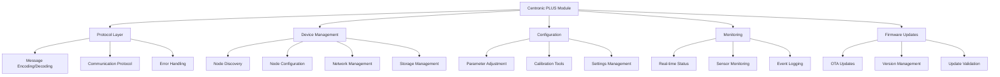

# Centronic PLUS Module

[](https://github.com/becker-antriebe/mod_cen_plus)
[](https://flutter.dev)
[](https://becker-antriebe.com)

## Overview

The Centronic PLUS Module is a comprehensive implementation of the Centronic PLUS motor control protocol, providing complete device management, configuration, and control capabilities for Becker motor systems. This module serves as the core component for professional motor control applications, offering real-time monitoring, parameter adjustment, and firmware management.

## Key Features

### 🎛️ **Protocol Implementation**
- **Complete Protocol Support**: Full Centronic PLUS protocol implementation
- **Real-time Communication**: Bidirectional communication with motor devices
- **Message Handling**: Comprehensive message encoding and decoding
- **Error Recovery**: Robust error handling and connection recovery

### 🔧 **Device Management**
- **Node Discovery**: Automatic device discovery and identification
- **Node Configuration**: Advanced parameter configuration and calibration
- **Network Management**: Device network setup and optimization
- **Storage Integration**: Persistent device configuration storage

### 📊 **Monitoring & Control**
- **Real-time Monitoring**: Live device status and sensor readings
- **Remote Control**: Remote motor control and operation
- **Status Reporting**: Comprehensive device status and health monitoring
- **Event Logging**: Detailed event logging and audit trails

### 🔄 **Firmware Management**
- **Over-the-Air Updates**: OTA firmware update capabilities
- **Version Management**: Firmware version tracking and compatibility
- **Update Validation**: Secure firmware update validation
- **Rollback Support**: Firmware rollback capabilities

## Architecture

### Core Components



### Protocol Stack
- **Application Layer**: High-level motor control operations
- **Protocol Layer**: Centronic PLUS message handling
- **Transport Layer**: Multi-transport communication (BLE, USB, Serial)
- **Physical Layer**: Hardware communication interfaces

## Dependencies

### Core Dependencies
```yaml
dependencies:
  # Protocol Implementation
  centronic_plus_protocol:
    path: ../../plugins/centronic_plus/
  
  # Common Functionality
  modules_common:
    path: ../modules_common/
  
  # Other Modules
  mod_evo:
    path: ../mod_evo/
  mod_update_file:
    path: ../mod_update_file/
  
  # Protocol Libraries
  cc_eleven_protocol:
    path: ../../plugins/cc_eleven/
```

## Core Classes

### CPModule
Main module class that implements the UICModule interface:
```dart
class CPModule extends UICModule {
  // Module initialization and configuration
  // Device discovery and connection management
  // Navigation and routing setup
}
```

### CentronicPlus
Core protocol implementation class:
```dart
class CentronicPlus {
  // Protocol communication
  // Message handling
  // Device management
  // Real-time updates
}
```

### Node Management
```dart
class CentronicPlusNode {
  // Individual device representation
  // Parameter management
  // Status monitoring
  // Configuration storage
}
```

## Usage

### Module Initialization
```dart
import 'package:mod_cen_plus/module.dart';

// Initialize the module
final cpModule = CPModule();

// Register with the application
app.modules.add(cpModule);
```

### Device Discovery
```dart
// Start device discovery
await cpModule.startDiscovery();

// Listen for discovered devices
cpModule.discoveredDevices.listen((devices) {
  for (final device in devices) {
    print('Discovered device: ${device.name}');
  }
});
```

### Device Connection
```dart
// Connect to a specific device
final device = discoveredDevices.first;
await cpModule.connectToDevice(device);

// Monitor connection status
cpModule.connectionStatus.listen((status) {
  if (status == ConnectionStatus.connected) {
    print('Device connected successfully');
  }
});
```

### Device Configuration
```dart
// Configure device parameters
await cpModule.configureDevice(device, {
  'motorSpeed': 50,
  'endPosition': 100,
  'safetyMode': true,
});

// Save configuration
await cpModule.saveConfiguration(device);
```

### Real-time Monitoring
```dart
// Monitor device status
cpModule.deviceStatus(device).listen((status) {
  print('Device status: ${status.position}');
  print('Motor speed: ${status.speed}');
  print('Temperature: ${status.temperature}');
});
```

### Firmware Updates
```dart
// Check for firmware updates
final updates = await cpModule.checkForUpdates(device);

if (updates.isNotEmpty) {
  // Perform OTA update
  await cpModule.performOTAUpdate(device, updates.first);
}
```

## Configuration

### Device Parameters
- **Motor Speed**: Speed control and adjustment
- **End Positions**: Position limits and calibration
- **Safety Settings**: Safety mode and emergency stop
- **Network Configuration**: Device network settings
- **Sensor Configuration**: Sensor assignment and calibration

### Protocol Settings
- **Communication Timeout**: Message timeout settings
- **Retry Logic**: Automatic retry configuration
- **Error Handling**: Error recovery settings
- **Logging Level**: Debug and logging configuration

## Device Types

### Supported Devices
- **Roller Shutters**: Automated roller shutter control
- **Awnings**: Retractable awning systems
- **Blinds**: Venetian and vertical blinds
- **Gates**: Automatic gate control systems
- **Windows**: Automated window control
- **Curtains**: Motorized curtain systems

### Device Capabilities
- **Position Control**: Precise position control and feedback
- **Speed Control**: Variable speed operation
- **Safety Features**: Built-in safety mechanisms
- **Sensor Integration**: Weather and light sensor support
- **Group Control**: Synchronized group operations

## Monitoring Features

### Real-time Status
- **Position**: Current device position
- **Speed**: Current motor speed
- **Temperature**: Device temperature monitoring
- **Voltage**: Power supply monitoring
- **Current**: Motor current monitoring

### Sensor Integration
- **Wind Sensors**: Wind speed and direction
- **Rain Sensors**: Precipitation detection
- **Light Sensors**: Ambient light measurement
- **Temperature Sensors**: Environmental temperature
- **Motion Sensors**: Movement detection

### Event Logging
- **Operation Events**: Device operation logs
- **Error Events**: Error and fault logging
- **Maintenance Events**: Maintenance and service logs
- **Configuration Changes**: Parameter change tracking

## Firmware Management

### OTA Updates
- **Secure Updates**: Cryptographically signed updates
- **Incremental Updates**: Delta update support
- **Rollback Capability**: Automatic rollback on failure
- **Update Validation**: Integrity verification

### Version Management
- **Version Tracking**: Current and available versions
- **Compatibility Checking**: Version compatibility validation
- **Update Scheduling**: Scheduled update management
- **Progress Monitoring**: Update progress tracking

## Troubleshooting

### Common Issues

#### Connection Problems
- **Device Not Found**: Check device power and proximity
- **Connection Timeout**: Verify communication settings
- **Authentication Failed**: Check device credentials
- **Protocol Mismatch**: Verify protocol version compatibility

#### Configuration Issues
- **Parameter Validation**: Check parameter ranges and types
- **Configuration Save Failed**: Verify storage permissions
- **Invalid Settings**: Validate configuration values
- **Device Reset**: Perform device factory reset if needed

#### Performance Issues
- **Slow Response**: Check network connectivity
- **High CPU Usage**: Optimize monitoring frequency
- **Memory Leaks**: Ensure proper resource disposal
- **Battery Drain**: Optimize communication intervals

### Debug Mode
```dart
// Enable debug logging
cpModule.enableDebugMode(true);

// Monitor protocol messages
cpModule.messageStream.listen((message) {
  print('Protocol message: $message');
});
```

## Development

### Project Structure
```
mod_cen_plus/
├── lib/
│   ├── module.dart              # Main module class
│   ├── home.dart                # Home screen
│   ├── remote_view.dart         # Remote control interface
│   ├── node_*.dart              # Node management screens
│   ├── widgets/                 # UI components
│   ├── providers/               # State management
│   ├── store/                   # Data storage
│   └── ota/                     # Firmware update functionality
├── pubspec.yaml                # Dependencies
└── README.md                   # This file
```

### Testing
```bash
# Run unit tests
flutter test

# Run integration tests
flutter test integration_test/

# Run protocol tests
flutter test test/protocol/
```

## Contributing

### Development Guidelines
1. Follow Centronic PLUS protocol specifications
2. Implement proper error handling
3. Add comprehensive tests
4. Document protocol changes
5. Ensure backward compatibility

### Code Style
- Use `dart format` for code formatting
- Follow existing naming conventions
- Add comprehensive comments
- Use type annotations where helpful

## License

This project is proprietary software developed by Becker-Antriebe GmbH. All rights reserved.

## Support

For technical support and questions:
- **Documentation**: [Internal Wiki](https://wiki.becker-antriebe.com)
- **Issues**: [Internal Issue Tracker](https://gitlab.becker-antriebe.com)
- **Email**: support@becker-antriebe.com

---

**Note**: This module implements the Centronic PLUS protocol for professional motor control applications. Always follow manufacturer guidelines and safety procedures when working with motor control systems.