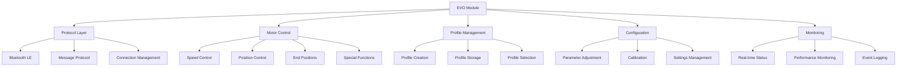

# EVO Module

[](https://github.com/becker-antriebe/mod_evo)
[](https://flutter.dev)
[](https://becker-antriebe.com)

## Overview

The EVO Module provides comprehensive support for EVO motor control systems, offering advanced motor management, profile configuration, and control capabilities. This module implements the complete EVO protocol with Bluetooth Low Energy connectivity, providing professional-grade motor control for various applications including roller shutters, awnings, and automated systems.

## Key Features

### 🎛️ **EVO Protocol Implementation**
- **Complete Protocol Support**: Full EVO protocol implementation with Bluetooth Low Energy
- **Real-time Communication**: Bidirectional communication with EVO devices
- **Message Handling**: Comprehensive message encoding and decoding
- **Connection Management**: Robust connection handling and recovery

### 🔧 **Motor Control**
- **Speed Control**: Variable speed motor control and adjustment
- **Position Control**: Precise position control with feedback
- **Profile Management**: Motor profile configuration and management
- **End Position Control**: Configurable end positions and limits

### 📊 **Advanced Features**
- **Special Functions**: Advanced motor functions and operations
- **Intermediate Positions**: Multiple intermediate position support
- **Motor Profiles**: Customizable motor operation profiles
- **Real-time Monitoring**: Live motor status and performance monitoring

### 🔄 **Configuration Management**
- **Parameter Adjustment**: Real-time parameter configuration
- **Profile Storage**: Persistent profile storage and management
- **Calibration Tools**: Motor calibration and setup utilities
- **Settings Backup**: Configuration backup and restore

## Architecture

### Core Components



### Protocol Stack
- **Application Layer**: High-level motor control operations
- **Protocol Layer**: EVO message handling and processing
- **Transport Layer**: Bluetooth Low Energy communication
- **Physical Layer**: BLE hardware interface

## Dependencies

### Core Dependencies
```yaml
dependencies:
  # Protocol Implementation
  evo_protocol:
    path: ../../plugins/evo/
  
  # Common Functionality
  modules_common:
    path: ../modules_common/
  
  # UI Components
  ui_common:
    path: ../../plugins/ui_common/
```

## Core Classes

### EvoModule
Main module class implementing UICModule interface:
```dart
class EvoModule extends UICModule {
  // Module initialization and configuration
  // Bluetooth LE discovery and connection
  // Navigation and routing setup
}
```

### Evo
Core protocol implementation class:
```dart
class Evo {
  // Protocol communication
  // Message handling
  // Motor control operations
  // Real-time updates
}
```

### Motor Profiles
```dart
class EvoProfile {
  // Motor profile configuration
  // Speed and position settings
  // Special function configuration
  // Profile storage and management
}
```

## Usage

### Module Initialization
```dart
import 'package:mod_evo/module.dart';

// Initialize the module
final evoModule = EvoModule();

// Register with the application
app.modules.add(evoModule);
```

### Device Discovery
```dart
// Start Bluetooth LE discovery
await evoModule.startDiscovery();

// Listen for discovered devices
evoModule.discoveredDevices.listen((devices) {
  for (final device in devices) {
    print('Discovered EVO device: ${device.name}');
  }
});
```

### Device Connection
```dart
// Connect to EVO device
final device = discoveredDevices.first;
await evoModule.connectToDevice(device);

// Monitor connection status
evoModule.connectionStatus.listen((status) {
  if (status == ConnectionStatus.connected) {
    print('EVO device connected successfully');
  }
});
```

### Motor Control
```dart
// Control motor speed
await evoModule.setMotorSpeed(device, 75);

// Move to specific position
await evoModule.moveToPosition(device, 50);

// Set end positions
await evoModule.setEndPositions(device, {
  'upper': 100,
  'lower': 0,
});
```

### Profile Management
```dart
// Create new motor profile
final profile = EvoProfile(
  name: 'Standard Profile',
  speed: 50,
  acceleration: 25,
  specialFunctions: ['AutoClose', 'WindProtection'],
);

// Save profile
await evoModule.saveProfile(device, profile);

// Load profile
await evoModule.loadProfile(device, profile.id);
```

### Real-time Monitoring
```dart
// Monitor motor status
evoModule.motorStatus(device).listen((status) {
  print('Current position: ${status.position}');
  print('Motor speed: ${status.speed}');
  print('Temperature: ${status.temperature}');
  print('Voltage: ${status.voltage}');
});
```

## Configuration

### Motor Parameters
- **Speed**: Motor speed control (0-100%)
- **Acceleration**: Motor acceleration/deceleration
- **End Positions**: Upper and lower position limits
- **Special Functions**: Advanced motor functions
- **Safety Settings**: Safety and protection settings

### Bluetooth LE Settings
- **Service UUID**: Primary service identifier
- **Characteristic UUIDs**: TX/RX characteristic identifiers
- **Connection Parameters**: BLE connection optimization
- **Security Settings**: Pairing and encryption settings

### Protocol Settings
- **Message Timeout**: Communication timeout settings
- **Retry Logic**: Automatic retry configuration
- **Error Handling**: Error recovery settings
- **Logging Level**: Debug and logging configuration

## Device Types

### Supported EVO Devices
- **EVO Roller Shutters**: Automated roller shutter control
- **EVO Awnings**: Retractable awning systems
- **EVO Blinds**: Venetian and vertical blinds
- **EVO Gates**: Automatic gate control systems
- **EVO Windows**: Automated window control

### Device Capabilities
- **Position Control**: Precise position control with feedback
- **Speed Control**: Variable speed operation
- **Special Functions**: Advanced automation features
- **Safety Features**: Built-in safety mechanisms
- **Energy Efficiency**: Power-saving operation modes

## Advanced Features

### Special Functions
- **Auto Close**: Automatic closing based on time or conditions
- **Wind Protection**: Wind sensor integration and protection
- **Sun Protection**: Sun position tracking and protection
- **Rain Protection**: Rain sensor integration
- **Frost Protection**: Temperature-based protection
- **Manual Override**: Manual control override capabilities

### Intermediate Positions
- **Multiple Positions**: Support for multiple intermediate positions
- **Position Memory**: Remember frequently used positions
- **Quick Access**: Quick access to predefined positions
- **Position Sequencing**: Sequential position movements

### Profile Management
- **Profile Creation**: Create custom motor profiles
- **Profile Storage**: Persistent profile storage
- **Profile Selection**: Easy profile switching
- **Profile Sharing**: Share profiles between devices

## Monitoring Features

### Real-time Status
- **Position**: Current motor position
- **Speed**: Current motor speed
- **Temperature**: Motor temperature monitoring
- **Voltage**: Power supply monitoring
- **Current**: Motor current monitoring
- **Status Flags**: Device status and error flags

### Performance Monitoring
- **Operation Time**: Motor operation time tracking
- **Cycle Count**: Operation cycle counting
- **Power Consumption**: Energy usage monitoring
- **Performance Metrics**: Motor performance analysis

### Event Logging
- **Operation Events**: Motor operation logs
- **Error Events**: Error and fault logging
- **Maintenance Events**: Maintenance and service logs
- **Configuration Changes**: Parameter change tracking

## Troubleshooting

### Common Issues

#### Bluetooth Connection Problems
- **Device Not Found**: Check Bluetooth LE availability and device proximity
- **Connection Timeout**: Verify Bluetooth settings and device pairing
- **Authentication Failed**: Check device pairing status
- **Protocol Mismatch**: Verify EVO protocol version compatibility

#### Motor Control Issues
- **Motor Not Responding**: Check device power and connection
- **Position Drift**: Perform motor calibration
- **Speed Issues**: Verify speed parameter settings
- **End Position Problems**: Recalibrate end positions

#### Configuration Issues
- **Parameter Validation**: Check parameter ranges and types
- **Profile Save Failed**: Verify storage permissions
- **Invalid Settings**: Validate configuration values
- **Device Reset**: Perform device factory reset if needed

### Debug Mode
```dart
// Enable debug logging
evoModule.enableDebugMode(true);

// Monitor protocol messages
evoModule.messageStream.listen((message) {
  print('EVO protocol message: $message');
});

// Monitor Bluetooth LE events
evoModule.bleEventStream.listen((event) {
  print('BLE event: $event');
});
```

## Development

### Project Structure
```
mod_evo/
├── lib/
│   ├── module.dart              # Main module class
│   ├── home.dart                # Home screen
│   ├── profiles.dart            # Profile management
│   ├── end_positions.dart       # End position control
│   ├── intermediate_positions.dart # Intermediate positions
│   ├── special_functions.dart   # Special functions
│   └── widgets/                 # UI components
├── pubspec.yaml                # Dependencies
└── README.md                   # This file
```

### Testing
```bash
# Run unit tests
flutter test

# Run integration tests
flutter test integration_test/

# Run protocol tests
flutter test test/protocol/

# Run Bluetooth LE tests
flutter test test/ble/
```

## Contributing

### Development Guidelines
1. Follow EVO protocol specifications
2. Implement proper Bluetooth LE handling
3. Add comprehensive tests
4. Document protocol changes
5. Ensure backward compatibility

### Code Style
- Use `dart format` for code formatting
- Follow existing naming conventions
- Add comprehensive comments
- Use type annotations where helpful

## License

This project is proprietary software developed by Becker-Antriebe GmbH. All rights reserved.

## Support

For technical support and questions:
- **Documentation**: [Internal Wiki](https://wiki.becker-antriebe.com)
- **Issues**: [Internal Issue Tracker](https://gitlab.becker-antriebe.com)
- **Email**: support@becker-antriebe.com

---

**Note**: This module implements the EVO protocol for professional motor control applications. Always follow manufacturer guidelines and safety procedures when working with motor control systems.