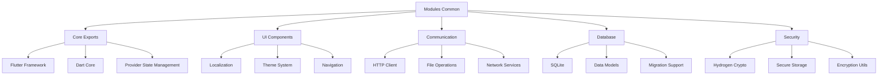

# Modules Common

[](https://github.com/becker-antriebe/modules_common)
[](https://flutter.dev)
[](https://dart.dev)

## Overview

Modules Common is a comprehensive shared library that provides essential functionality, utilities, and base classes used across all Becker applications and modules. It serves as the foundation layer for the entire Becker ecosystem, ensuring consistency, reducing code duplication, and providing a unified development experience.

## Key Features

### 🔧 **Core Functionality**
- **Unified Exports**: Centralized import/export management for all common dependencies
- **Cross-Platform Support**: Consistent APIs across Android, Windows, macOS, Linux, and Web
- **State Management**: Provider-based state management utilities
- **Database Integration**: SQLite database operations and management

### 🌐 **Communication & Networking**
- **HTTP Client**: Standardized HTTP communication utilities
- **File Operations**: Cross-platform file handling and management
- **Network Services**: Geolocation and network-aware functionality
- **Archive Support**: File compression and archive operations

### 🎨 **UI & Localization**
- **Internationalization**: Comprehensive i18n support with 11+ languages
- **Localization Utilities**: Date/time formatting and number formatting
- **UI Components**: Shared UI elements and navigation patterns
- **Theme Support**: Consistent theming across applications

### 🔐 **Security & Cryptography**
- **Cryptographic Functions**: Integration with Hydrogen cryptographic library
- **Secure Communication**: Encrypted communication protocols
- **Data Protection**: Secure data storage and transmission utilities

## Architecture

### Core Components



### Design Principles
- **Single Source of Truth**: Centralized dependency management
- **Consistency**: Uniform APIs across all modules
- **Performance**: Optimized for cross-platform performance
- **Maintainability**: Clean architecture for easy updates

## Dependencies

### Core Dependencies
```yaml
dependencies:
  flutter:
    sdk: flutter
  
  # State Management
  provider: ^6.0.5
  
  # Database
  sqflite_common_ffi: ^2.3.5
  sqflite: ^2.4.2
  
  # Networking & Communication
  http: ^1.2.1
  geolocator: ^14.0.0
  
  # File Operations
  file_picker: ^10.1.9
  archive: ^4.0.1
  path_provider: ^2.1.1
  path: ^1.9.1
  open_filex: ^4.7.0
  
  # Localization
  intl: ^0.20.2
  
  # System Integration
  wakelock_plus: ^1.2.2
  window_manager: ^0.5.1
  open_settings_plus: ^0.4.0
  
  # Utilities
  vector_math: ^2.1.4
  collection: ^1.17.1
  ffi: ^2.0.2
  version: ^3.0.2
  json_annotation: ^4.9.0
  yaml: ^3.1.2
  flutter_oss_licenses: ^3.0.4
  
  # Internal Dependencies
  ui_common:
    path: ../../plugins/ui_common/
  multi_transport:
    path: ../../plugins/multi_transport/
  hydrogen_flutter:
    path: ../../plugins/hydrogen_flutter
```

## Core Exports

### Flutter Framework
```dart
export 'package:flutter/material.dart';
export 'package:flutter/gestures.dart';
export 'package:flutter/services.dart';
export 'package:flutter/foundation.dart' show compute;
```

### Dart Core Libraries
```dart
export 'dart:io' show File, Platform;
export 'dart:ffi' hide Size;
export 'dart:async';
export 'dart:math';
export 'dart:convert';
```

### State Management
```dart
export 'package:provider/provider.dart';
```

### Database & Storage
```dart
export 'package:sqflite_common_ffi/sqflite_ffi.dart';
export 'package:path_provider/path_provider.dart';
```

### Communication & Networking
```dart
export 'package:http/http.dart';
export 'package:geolocator/geolocator.dart';
```

### File Operations
```dart
export 'package:file_picker/file_picker.dart';
export 'package:archive/archive_io.dart';
export 'package:path/path.dart';
export 'package:open_filex/open_filex.dart';
```

### Localization
```dart
export 'package:intl/intl.dart' show DateFormat, NumberFormat;
export 'package:intl/date_symbol_data_local.dart' show initializeDateFormatting;
```

### Security & Cryptography
```dart
export 'package:ffi/ffi.dart' show calloc, StringUtf8Pointer;
export 'package:hydrogen_flutter/hydrogen_flutter_stub.dart' show bindings;
```

### Utilities
```dart
export 'package:vector_math/vector_math_64.dart' show radians, degrees;
export 'package:collection/collection.dart';
export 'package:version/version.dart';
export 'package:json_annotation/json_annotation.dart';
export 'package:yaml/yaml.dart';
```

### System Integration
```dart
export 'package:wakelock_plus/wakelock_plus.dart';
export 'package:window_manager/window_manager.dart';
export 'package:open_settings_plus/open_settings_plus.dart';
export 'package:flutter_oss_licenses/flutter_oss_licenses.dart';
```

### Internal Libraries
```dart
export 'package:ui_common/ui_common.dart';
export 'package:multi_transport/multi_transport.dart';
```

## Usage

### Basic Import
```dart
import 'package:modules_common/modules_common.dart';

// Now you have access to all common dependencies
```

### Database Operations
```dart
import 'package:modules_common/modules_common.dart';

class DatabaseService {
  static Database? _database;
  
  static Future<Database> get database async {
    if (_database != null) return _database!;
    _database = await _initDatabase();
    return _database!;
  }
  
  static Future<Database> _initDatabase() async {
    final dbPath = await getDatabasesPath();
    return await openDatabase(
      join(dbPath, 'becker_app.db'),
      version: 1,
      onCreate: (db, version) {
        // Create tables
      },
    );
  }
}
```

### HTTP Operations
```dart
import 'package:modules_common/modules_common.dart';

class ApiService {
  static Future<Map<String, dynamic>> fetchData(String url) async {
    final response = await get(Uri.parse(url));
    if (response.statusCode == 200) {
      return json.decode(response.body);
    }
    throw Exception('Failed to load data');
  }
}
```

### Localization
```dart
import 'package:modules_common/modules_common.dart';

class LocalizationService {
  static String formatDate(DateTime date, String locale) {
    final formatter = DateFormat.yMMMd(locale);
    return formatter.format(date);
  }
  
  static String formatNumber(double number, String locale) {
    final formatter = NumberFormat.currency(locale: locale);
    return formatter.format(number);
  }
}
```

### File Operations
```dart
import 'package:modules_common/modules_common.dart';

class FileService {
  static Future<File> saveFile(String content, String filename) async {
    final directory = await getApplicationDocumentsDirectory();
    final file = File('${directory.path}/$filename');
    await file.writeAsString(content);
    return file;
  }
  
  static Future<String> readFile(String filename) async {
    final directory = await getApplicationDocumentsDirectory();
    final file = File('${directory.path}/$filename');
    return await file.readAsString();
  }
}
```

## Configuration

### Environment Requirements
```yaml
environment:
  sdk: ^3.7.2
  flutter: '>=3.3.0'
```

### Platform Support
- **Android**: API level 21+
- **iOS**: iOS 11.0+
- **Windows**: Windows 10+
- **macOS**: macOS 10.15+
- **Linux**: Ubuntu 18.04+
- **Web**: Modern browsers with WebAssembly support

## Development

### Project Structure
```
modules_common/
├── lib/
│   ├── modules_common.dart    # Main export file
│   ├── http.dart              # HTTP utilities
│   └── path.dart              # Path utilities
├── pubspec.yaml              # Dependencies and configuration
├── analysis_options.yaml     # Code analysis configuration
├── README.md                 # This file
└── LICENSE                   # License information
```

### Building
```bash
# Install dependencies
flutter pub get

# Run tests
flutter test

# Analyze code
flutter analyze

# Format code
dart format .
```

### Testing
```bash
# Run all tests
flutter test

# Run specific test file
flutter test test/modules_common_test.dart

# Run tests with coverage
flutter test --coverage
```

## Best Practices

### Import Management
- Always import from `modules_common` instead of individual packages
- Use the unified export system for consistency
- Avoid direct imports of packages that are re-exported

### State Management
- Use Provider for state management
- Implement proper disposal of resources
- Follow the established patterns for state updates

### Database Operations
- Use transactions for multiple operations
- Implement proper error handling
- Follow the established schema patterns

### File Operations
- Use the provided file utilities
- Implement proper error handling
- Follow platform-specific guidelines

## Troubleshooting

### Common Issues

#### Import Errors
- Ensure all dependencies are properly installed
- Check for version conflicts
- Verify the import path is correct

#### Platform-Specific Issues
- Check platform-specific dependencies
- Verify platform permissions
- Test on target platforms

#### Performance Issues
- Monitor memory usage
- Optimize database queries
- Use proper disposal patterns

### Debug Mode
```bash
# Enable debug logging
flutter run --debug --verbose

# Check dependency tree
flutter pub deps

# Analyze dependencies
flutter pub deps --style=tree
```

## Contributing

### Development Guidelines
1. Follow Flutter/Dart style guidelines
2. Use meaningful commit messages
3. Add tests for new functionality
4. Update documentation as needed
5. Ensure cross-platform compatibility

### Code Style
- Use `dart format` for code formatting
- Follow existing naming conventions
- Add comprehensive comments
- Use type annotations where helpful

### Testing Requirements
- Unit tests for all new functionality
- Integration tests for complex workflows
- Platform-specific testing
- Performance testing for critical paths

## License

This project is proprietary software developed by Becker-Antriebe GmbH. All rights reserved.

## Support

For technical support and questions:
- **Documentation**: [Internal Wiki](https://wiki.becker-antriebe.com)
- **Issues**: [Internal Issue Tracker](https://gitlab.becker-antriebe.com)
- **Email**: support@becker-antriebe.com

---

**Note**: This library is the foundation of the entire Becker ecosystem. Changes to this library should be carefully considered and thoroughly tested across all dependent modules and applications.