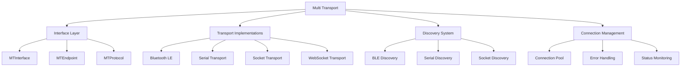

# Multi Transport

[](https://github.com/becker-antriebe/multi_transport)
[](https://flutter.dev)
[](https://flutter.dev)

## Overview

Multi Transport is a platform-independent transport layer that provides unified communication interfaces for Bluetooth Low Energy, serial, and socket connections. It abstracts different communication protocols under a single interface, enabling consistent device communication across various platforms and transport methods.

## Key Features

### 🔌 **Multi-Protocol Support**
- **Bluetooth Low Energy**: Cross-platform BLE communication
- **Serial Communication**: USB and serial port communication
- **Socket Communication**: TCP/UDP and WebSocket support
- **Unified Interface**: Single API for all transport methods

### 🌐 **Cross-Platform Compatibility**
- **Android**: Native Android BLE and USB support
- **Windows**: Windows BLE and USB communication
- **macOS**: macOS BLE and USB support
- **Linux**: Linux serial and socket communication
- **Web**: WebSocket communication for web applications

### 🔍 **Device Discovery**
- **Automatic Discovery**: Automatic device detection and enumeration
- **Service Discovery**: BLE service and characteristic discovery
- **Connection Management**: Robust connection handling and recovery
- **Multi-Device Support**: Simultaneous multiple device connections

### 📡 **Communication Management**
- **Message Handling**: Bidirectional message communication
- **Protocol Abstraction**: Protocol-agnostic communication layer
- **Error Recovery**: Automatic error detection and recovery
- **Connection Monitoring**: Real-time connection status monitoring

## Architecture

### Core Components



### Transport Stack
- **Interface Layer**: Unified API for all transports
- **Transport Layer**: Platform-specific implementations
- **Discovery Layer**: Device discovery and enumeration
- **Connection Layer**: Connection management and monitoring

## Dependencies

### Core Dependencies
```yaml
dependencies:
  flutter:
    sdk: flutter
  mt_interface:
    path: ./mt_interface
  mt_ble:
    path: ./mt_ble
  mt_serial:
    path: ./mt_serial
  mt_sock:
    path: ./mt_sock
```

### Platform-Specific Dependencies
- **Android**: `flutter_blue_plus`, `usb_serial`
- **Windows**: `win_ble`, `serial_port_windows`
- **macOS**: `flutter_blue_plus`, `serial_port_macos`
- **Linux**: `serial_port_linux`, `web_socket_channel`
- **Web**: `web_socket_channel`

## Core Classes

### MTInterface
Main interface class for transport management:
```dart
class MTInterface {
  static final MTInterface instance = MTInterface._();
  
  // Transport management
  // Device discovery
  // Connection handling
}
```

### MTEndpoint
Represents a communication endpoint:
```dart
class MTEndpoint<T> {
  // Endpoint identification
  // Connection management
  // Message communication
}
```

### Transport Interfaces
```dart
class MTTransportInterface {
  // Transport-specific implementation
  // Device discovery
  // Connection management
}
```

## Usage

### Basic Setup
```dart
import 'package:multi_transport/multi_transport.dart';

// Initialize multi-transport
final mt = MTInterface.instance;

// Register transports
MTBLE.registerWith();
MTSerial.registerWith();
MTWebSocket.registerWith();
```

### Device Discovery
```dart
// Configure discovery
final configs = [
  BLEDiscoveryConfig(
    protocolName: "CentronicPlus",
    primaryServiceId: "0000180f-0000-1000-8000-00805f9b34fb",
    vendorId: 2065,
    productId: [0x43, 0x50, 0x31, 0x31],
  ),
];

// Start discovery
await mt.startScan(configs);

// Listen for discovered devices
mt.scanResult.stream.listen((devices) {
  for (final device in devices) {
    print('Discovered: ${device.name}');
  }
});
```

### Device Connection
```dart
// Connect to device
final device = discoveredDevices.first;
await device.openWith(protocol);

// Monitor connection status
device.connectionStatus.listen((status) {
  print('Connection status: $status');
});
```

### Message Communication
```dart
// Send message
await endpoint.write([0x01, 0x02, 0x03]);

// Receive messages
endpoint.messageStream.listen((message) {
  print('Received: $message');
});
```

## Transport Types

### Bluetooth Low Energy (BLE)
```dart
class MTBLE extends MTTransportInterface {
  // BLE-specific implementation
  // Service and characteristic management
  // Connection handling
}
```

### Serial Communication
```dart
class MTSerial extends MTTransportInterface {
  // Serial port communication
  // USB device handling
  // Port enumeration
}
```

### Socket Communication
```dart
class MTSocket extends MTTransportInterface {
  // TCP/UDP communication
  // Network socket handling
  // Connection management
}
```

### WebSocket Communication
```dart
class MTWebSocket extends MTTransportInterface {
  // WebSocket communication
  // Web platform support
  // Real-time messaging
}
```

## Configuration

### BLE Configuration
```dart
BLEDiscoveryConfig(
  protocolName: "MyProtocol",
  primaryServiceId: "12345678-1234-1234-1234-123456789abc",
  vendorId: 1234,
  productId: [0x01, 0x02, 0x03, 0x04],
  services: [
    BLEDiscoveryService(
      protocolName: "MyProtocol",
      serviceId: "12345678-1234-1234-1234-123456789abc",
      tx: "12345678-1234-1234-1234-123456789abd",
      rx: "12345678-1234-1234-1234-123456789abe",
    ),
  ],
)
```

### Serial Configuration
```dart
SerialDiscoveryConfig(
  protocolName: "SerialProtocol",
  baudRate: 9600,
  dataBits: 8,
  stopBits: 1,
  parity: Parity.none,
)
```

### Socket Configuration
```dart
SocketDiscoveryConfig(
  protocolName: "SocketProtocol",
  host: "192.168.1.100",
  port: 8080,
  protocol: SocketProtocol.tcp,
)
```

## Platform Support

### Android
- Bluetooth Low Energy via `flutter_blue_plus`
- USB Serial via `usb_serial`
- Network sockets via standard Dart libraries

### Windows
- Bluetooth Low Energy via `win_ble`
- Serial ports via `serial_port_windows`
- Network sockets via standard libraries

### macOS
- Bluetooth Low Energy via `flutter_blue_plus`
- Serial ports via `serial_port_macos`
- Network sockets via standard libraries

### Linux
- Serial ports via `serial_port_linux`
- Network sockets via standard libraries
- WebSocket support for web applications

### Web
- WebSocket communication via `web_socket_channel`
- Web Bluetooth API (limited support)
- HTTP/HTTPS communication

## Error Handling

### Connection Errors
```dart
try {
  await endpoint.openWith(protocol);
} on MTConnectionException catch (e) {
  print('Connection failed: ${e.message}');
} on MTTimeoutException catch (e) {
  print('Connection timeout: ${e.message}');
}
```

### Communication Errors
```dart
try {
  await endpoint.write(data);
} on MTCommunicationException catch (e) {
  print('Communication error: ${e.message}');
}
```

### Discovery Errors
```dart
try {
  await mt.startScan(configs);
} on MTDiscoveryException catch (e) {
  print('Discovery error: ${e.message}');
}
```

## Troubleshooting

### Common Issues

#### BLE Connection Problems
- Check device proximity and pairing status
- Verify service and characteristic UUIDs
- Ensure proper permissions on mobile platforms
- Check device compatibility and firmware version

#### Serial Connection Issues
- Verify port availability and permissions
- Check baud rate and communication parameters
- Ensure proper USB drivers on Windows
- Test with serial terminal applications

#### Socket Connection Problems
- Check network connectivity and firewall settings
- Verify host address and port availability
- Ensure proper network permissions
- Test with network diagnostic tools

### Debug Mode
```dart
// Enable debug logging
MTInterface.debugMode = true;

// Monitor transport events
MTInterface.eventStream.listen((event) {
  print('Transport event: $event');
});
```

## Development

### Project Structure
```
multi_transport/
├── lib/
│   └── multi_transport.dart    # Main export file
├── mt_interface/               # Interface definitions
├── mt_ble/                     # BLE implementation
├── mt_serial/                  # Serial implementation
├── mt_sock/                    # Socket implementation
└── pubspec.yaml               # Dependencies
```

### Building
```bash
# Install dependencies
flutter pub get

# Run tests
flutter test

# Analyze code
flutter analyze
```

### Testing
```bash
# Run unit tests
flutter test

# Run integration tests
flutter test integration_test/

# Run platform-specific tests
flutter test test/ble/
flutter test test/serial/
flutter test test/socket/
```

## Contributing

### Development Guidelines
1. Follow platform-specific best practices
2. Implement proper error handling
3. Add comprehensive tests
4. Document transport-specific features
5. Ensure cross-platform compatibility

### Code Style
- Use `dart format` for code formatting
- Follow existing naming conventions
- Add comprehensive comments
- Use type annotations where helpful

## License

This project is proprietary software developed by Becker-Antriebe GmbH. All rights reserved.

## Support

For technical support and questions:
- **Documentation**: [Internal Wiki](https://wiki.becker-antriebe.com)
- **Issues**: [Internal Issue Tracker](https://gitlab.becker-antriebe.com)
- **Email**: support@becker-antriebe.com

---

**Note**: This library provides the communication foundation for all Becker applications. Changes to this library should be carefully considered and thoroughly tested across all supported platforms and transport methods.