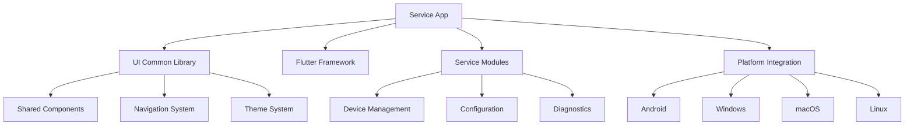

# Service App

[](https://github.com/becker-antriebe/service_app)
[](https://flutter.dev)
[](https://flutter.dev/docs/development/platform-integration)

## Overview

The Service App is a lightweight Flutter application designed to provide basic service and maintenance functionality for Becker motor control systems. It serves as a simplified interface for quick service tasks, basic device management, and essential maintenance operations.

## Key Features

### 🔧 **Basic Service Functions**
- **Device Connectivity**: Simple device connection and status monitoring
- **Basic Configuration**: Essential parameter adjustment and settings
- **Service Utilities**: Maintenance tools and diagnostic functions
- **Status Monitoring**: Real-time device status and health monitoring

### 📱 **Cross-Platform Support**
- **Android**: Mobile app for field service operations
- **Windows**: Desktop application for service centers
- **macOS**: Native macOS support
- **Linux**: Development and deployment support
- **Web**: Browser-based access for remote support

### 🎨 **Simplified Interface**
- **Clean UI**: Streamlined interface focused on essential functions
- **Quick Access**: Fast access to common service tasks
- **Minimal Dependencies**: Lightweight application with minimal resource usage
- **Responsive Design**: Optimized for various screen sizes and orientations

### 🌐 **Internationalization**
- **Multi-language Support**: Flutter localization framework
- **Extensible**: Easy addition of new languages
- **Consistent**: Unified translation management

## Architecture

### Core Components



### Design Philosophy
- **Simplicity**: Focus on essential functionality
- **Reliability**: Stable operation for service environments
- **Performance**: Fast startup and responsive interface
- **Maintainability**: Clean code structure for easy updates

## Installation & Setup

### Prerequisites
- Flutter SDK 3.0.6 or higher
- Dart SDK 3.0.6 or higher
- Platform-specific development tools

### Quick Start

```bash
# Clone the repository
git clone <repository-url>
cd service_app

# Install dependencies
flutter pub get

# Run on specific platform
flutter run -d android --verbose
flutter run -d windows --verbose
flutter run -d macos --verbose
flutter run -d linux --verbose
flutter run -d web --verbose
```

### Platform-Specific Setup

#### Android
- Android Studio
- Android SDK API level 21 or higher
- Minimum Android 5.0 (API level 21)

#### Windows
- Visual Studio with C++ development tools
- Windows SDK 10.0 or higher

#### macOS
- Xcode 14.0 or higher
- macOS 10.15 or higher

#### Linux
- CMake 3.10 or higher
- GTK 3.0 development libraries

#### Web
- Modern web browser with WebAssembly support
- HTTPS for production deployment

## Configuration

### Application Configuration
- **App Name**: Service App
- **Bundle ID**: Configurable per platform
- **Version**: 1.0.0+1
- **Minimum SDK**: 3.0.6

### Asset Management
- **Fonts**: 
  - SourceCodePro (monospace font for technical displays)
  - BeckerIcons (custom icon font for Becker-specific icons)
- **Images**: Platform-specific icons and splash screens
- **Localization**: Multi-language support framework

### Platform-Specific Configuration

#### Android
```xml
<application
    android:label="service_app"
    android:name="${applicationName}"
    android:icon="@mipmap/ic_launcher">
    <!-- Configuration details -->
</application>
```

#### iOS
```xml
<key>CFBundleDisplayName</key>
<string>Service App</string>
<key>CFBundleName</key>
<string>service_app</string>
```

#### Web
```json
{
    "name": "service_app",
    "short_name": "service_app",
    "description": "A new Flutter project.",
    "display": "standalone"
}
```

## Development

### Project Structure
```
service_app/
├── lib/
│   └── main.dart              # Application entry point
├── assets/                    # Application assets
├── android/                   # Android platform files
├── ios/                       # iOS platform files
├── windows/                   # Windows platform files
├── macos/                     # macOS platform files
├── linux/                     # Linux platform files
├── web/                       # Web platform files
└── pubspec.yaml              # Dependencies and configuration
```

### Key Dependencies
- **Flutter SDK**: Core Flutter framework
- **ui_common**: Shared UI components from Becker UI library
- **flutter_localizations**: Internationalization support

### Building for Production

```bash
# Build for Android
flutter build apk --release
flutter build appbundle --release

# Build for Windows
flutter build windows --release

# Build for macOS
flutter build macos --release

# Build for Linux
flutter build linux --release

# Build for Web
flutter build web --release
```

## Usage

### Basic Service Operations

#### 1. Device Connection
1. Launch the application
2. Navigate to device connection screen
3. Select connection method (Bluetooth/USB/Network)
4. Connect to target device
5. Verify connection status

#### 2. Status Monitoring
1. View device status dashboard
2. Monitor real-time parameters
3. Check device health indicators
4. Review error logs and diagnostics

#### 3. Basic Configuration
1. Access configuration menu
2. Adjust essential parameters
3. Save configuration changes
4. Verify parameter updates

#### 4. Service Utilities
1. Run diagnostic tests
2. Perform maintenance routines
3. Update device settings
4. Generate service reports

### Interface Navigation
- **Home Screen**: Main dashboard with device status
- **Device List**: Available devices and connection status
- **Configuration**: Basic device settings and parameters
- **Diagnostics**: Service tools and diagnostic functions
- **Settings**: Application preferences and options

## Features

### Device Management
- **Connection Management**: Simple device connection and disconnection
- **Status Display**: Real-time device status and health monitoring
- **Basic Configuration**: Essential parameter adjustment
- **Error Handling**: Graceful error handling and user feedback

### Service Tools
- **Diagnostic Functions**: Basic diagnostic and testing tools
- **Maintenance Routines**: Scheduled maintenance and cleaning functions
- **Report Generation**: Service report creation and export
- **Log Management**: Device log viewing and analysis

### User Interface
- **Responsive Design**: Optimized for various screen sizes
- **Intuitive Navigation**: Simple and clear navigation structure
- **Accessibility**: Support for accessibility features
- **Theme Support**: Light and dark theme options

## Troubleshooting

### Common Issues

#### Application Startup Problems
- Verify Flutter installation
- Check platform-specific dependencies
- Clear application cache
- Restart development environment

#### Device Connection Issues
- Check device compatibility
- Verify connection permissions
- Restart device and application
- Check network connectivity

#### Performance Issues
- Close unnecessary applications
- Check available memory
- Update to latest version
- Restart application

### Debug Mode
Enable debug mode for detailed logging:
```bash
flutter run --debug --verbose
```

### Log Analysis
- Check Flutter logs for error messages
- Review device-specific logs
- Monitor network traffic
- Analyze performance metrics

## Contributing

### Development Guidelines
1. Follow Flutter/Dart style guidelines
2. Use meaningful commit messages
3. Add tests for new features
4. Update documentation as needed
5. Test across all supported platforms

### Code Style
- Use `dart format` for code formatting
- Follow existing naming conventions
- Add comprehensive comments
- Use type annotations where helpful
- Maintain consistent code structure

### Testing
- Unit tests for business logic
- Widget tests for UI components
- Integration tests for user workflows
- Platform-specific testing

## Future Enhancements

### Planned Features
- **Advanced Diagnostics**: Enhanced diagnostic capabilities
- **Remote Support**: Remote assistance and support features
- **Cloud Integration**: Cloud-based configuration and monitoring
- **AI Assistance**: AI-powered troubleshooting and recommendations

### Performance Improvements
- **Faster Startup**: Optimized application startup time
- **Memory Optimization**: Reduced memory footprint
- **Battery Efficiency**: Improved battery usage on mobile devices
- **Network Optimization**: Enhanced network communication

## License

This project is proprietary software developed by Becker-Antriebe GmbH. All rights reserved.

## Support

For technical support and questions:
- **Documentation**: [Internal Wiki](https://wiki.becker-antriebe.com)
- **Issues**: [Internal Issue Tracker](https://gitlab.becker-antriebe.com)
- **Email**: support@becker-antriebe.com

---

**Note**: This application is designed for basic service operations. For advanced configuration and installation tasks, please use the full-featured Install Tool or Control Tool applications.